# Docker Connector User Guide

## Desktop access

Docker Connector supports desktop Obsidian on macOS, Windows, and Linux. Local Docker Socket, Docker Context, Remote Docker via SSH, and Remote Docker API (Mutual TLS) use desktop runtime capabilities such as local sockets, the Docker CLI, SSH, and certificate files.

Docker Connector is an Obsidian desktop plugin for monitoring Docker environments and, when you explicitly enable it, carrying out a small set of container-management actions. It keeps local and remote Docker environments in one Obsidian workspace without trying to replace Docker Desktop, the Docker CLI, or a full deployment platform.

Docker Connector is read-only by default. You can inspect hosts, Docker Compose applications, containers, images, volumes, networks, and image-update availability without enabling container management. Lifecycle and update actions are deliberately opt-in.

> [!warning] Docker access is highly privileged
> A person or process that can control a Docker daemon can often gain extensive control of that Docker host. Connect only to hosts and credentials you trust. The safeguards in Docker Connector reduce accidental risk; they do not make Docker-daemon access low-risk.

## 1. About Docker Connector

Docker Connector supports multiple saved Docker environments. Each saved connection has its own status, inventory, cached dashboard data, and runtime credentials. Select one environment as the **Current Environment** to view its Overview, Applications, Containers, Images, Volumes, and Networks.

The current release supports four desktop connection methods:

| Method | Best for | Authentication | Direct Docker API exposure |
| --- | --- | --- | --- |
| Local Docker Socket | Docker running on the same computer as Obsidian | Local operating-system and Docker permissions | No |
| Docker Context | An existing Docker CLI configuration | Defined by the selected Context | Depends on the Context |
| Remote Docker via SSH | Most remote Docker hosts | Password or private key | No |
| Remote Docker API (Mutual TLS) | A deliberately secured direct Docker Engine API | CA certificate, client certificate, and client private key | Yes |

Plain unauthenticated Docker TCP is not supported.

## 2. Important security information

Docker Connector is designed to make its boundaries visible:

- It is read-only until **Container management** is enabled for an Online connection from its Connections-card switch.
- Its normal Docker Engine client is limited to approved GET requests. Start, Stop, Shut down, Restart, and Update use dedicated, typed operations rather than a general-purpose Docker API console.
- Passwords and private-key passphrases are runtime-only by default. An SSH password profile can explicitly opt in to separate, unencrypted local plugin-data storage on a trusted device; see [[#Password authentication]].
- Remote Docker via SSH keeps Docker API traffic inside the SSH session. It does not require a direct Docker API listener.
- Mutual TLS requires server-certificate verification and a client certificate. Docker Connector does not offer an insecure “accept any certificate” mode.
- Docker Context discovery and use never changes your active Docker Context.
- Delete connection removes Docker Connector data only; it never deletes Docker resources or external credential files.

## 3. Requirements

Docker Connector supports desktop Obsidian on macOS, Windows, and Linux. Local Docker Socket, Docker Context, SSH, and mutual TLS require desktop capabilities.

You also need appropriate access for the method you select:

- **Local Docker Socket:** Docker Engine or Docker Desktop running locally, and permission to open its socket or named pipe.
- **Docker Context:** Docker CLI installed locally and an existing Docker Context. The context is discovered; Docker Connector does not create or modify it.
- **Remote Docker via SSH:** SSH access to the Docker host and permission for that remote account to use the configured Docker socket without interactive `sudo`.
- **Remote Docker API (Mutual TLS):** a Docker Engine HTTPS endpoint configured for mutual TLS, plus a CA certificate, client certificate, and matching client private key.

## 4. Installation

When Docker Connector is available through Obsidian Community Plugins, install it from **Settings → Community plugins → Browse**, search for **Docker Connector**, then install and enable it. If it is not yet listed in the Community Plugin directory, use the project’s release instructions rather than copying source files into your vault.

For a manual release installation, the plugin directory needs only `main.js`, `manifest.json`, and `styles.css`. Source files, test fixtures, and `node_modules` are not required for normal use.

## 5. First launch

On first launch there are no saved Docker connections. Open **Connections** and choose **Add Docker host**. After testing and saving a host, choose it as the Current Environment to populate the dashboard.

### Empty Docker connections state
<div align="center">


</div>

## 6. Understanding the interface

The header identifies the Current Environment and its connection status. Use the refresh control for an immediate read-only snapshot refresh. When automatic refresh is enabled, Docker Connector also refreshes configured hosts in the background at the interval chosen in Settings. **Container management** is not part of the header. Each host's switch is on its own card in **Connections**, where **Read-only** is off and **Enabled** is on for that profile only. It is unavailable for **All Docker hosts** and for any non-Online profile.

The primary navigation contains **Overview**, **Applications**, **Containers**, **Images**, **Volumes**, **Networks**, and **Connections**. The resource tabs show data for the Current Environment; their search, filter, sort, and detail controls never mutate Docker resources.

### Main Docker Connector dashboard
<div align="center">


</div>

## 7. Adding a Docker host

1. Open **Connections**.
2. Select **Add Docker host**.
3. Provide a **Friendly name**. Description and Category are optional organization fields.
4. Select a **Connection type**.
5. Complete only the fields for that method.
6. Choose **Test connection** and review the transport-specific diagnostics.
7. Choose **Save host**.

On desktop, drag the dialog by its title bar or resize it from its lower-right edge. On touch and narrow layouts, it remains viewport-safe without draggable controls.

### Add Docker host dialog
<div align="center">


</div>

Testing before saving is strongly recommended. A successful test proves the selected profile can validate its endpoint and obtain safe Docker information; saving then registers the profile for the normal dashboard refresh lifecycle.

## 8. Connection methods

### Connection type selector
<div align="center">


</div>

### 8.1 Local Docker Socket

**Local Docker Socket** connects to Docker running on the same computer as Obsidian. On macOS and Linux this is a Unix socket; on Windows it is a Docker named pipe. Docker Connector discovers common local endpoints and validates the endpoint before connecting.

On macOS, Docker Desktop commonly uses a user socket such as `~/.docker/run/docker.sock`; `/var/run/docker.sock` may be a compatibility symlink. Docker Connector resolves and validates supported socket symlinks rather than replacing them. No SSH credentials, TLS files, or Docker TCP listener are involved.

The **Docker endpoint** field can show the detected local Unix socket or Windows named pipe. If Docker Desktop is stopped, the endpoint is missing, the symlink is broken, or your account cannot open it, Test connection explains that local endpoint problem.

### Local Docker Socket configuration
<div align="center">


</div>

### 8.2 Docker Context

A **Docker Context** is a Docker CLI connection profile. Docker Connector finds existing contexts through the local Docker CLI and does not run `docker context use`, create, update, remove, import, or export a context.

This distinction matters: Docker Connector uses the context you select without changing the context that your terminal or other Docker tools consider active. The Docker CLI must be installed, but the CLI being present is separate from whether the Docker Engine is currently reachable.

The plugin performs bounded discovery of the Docker CLI from the current process PATH and standard platform locations. This helps normal macOS GUI launches, where Obsidian can inherit a different PATH than Terminal, without invoking a login shell or reading shell startup files.

### Docker CLI detected
<div align="center">


</div>

Docker Connector resolves a selected Context to the right physical transport each time it is used:

- a `unix://` Context uses the local Docker transport;
- a Windows `npipe://` Context uses the local named-pipe transport;
- an `ssh://` Context uses Docker CLI’s explicit Context-backed secure transport;
- insecure, unknown, and endpoint types that cannot be handled safely are blocked.

The saved profile and connection card still say **Docker Context**, even when the underlying transport is local.

### 8.3 Remote Docker via SSH

**Remote Docker via SSH** is usually the most straightforward remote choice. Docker Connector opens an SSH session and runs Docker’s secure `docker system dial-stdio` transport through that session. The Docker API is therefore transported over SSH and does not need to be directly exposed to the network.

Configure:

- **SSH Host** and **SSH Port**;
- **SSH Username**;
- **SSH authentication**: Password or Private Key;
- **Remote Docker socket**; and
- **Host key fingerprint** when host identity verification is required by the connection workflow.

The remote account must be able to access the configured Docker socket without interactive `sudo`.

#### Password authentication

With **Password** selected, enter the SSH password during connection or reconnection. Docker Connector keeps that password in memory only for the current Obsidian session by default. It is not stored in the saved profile, so a profile can show **Authentication required** after Obsidian restarts. Choose **Reconnect** to provide it again.

For a password profile only, **Remember password on this device** is an optional, off-by-default choice. It stores the password separately in local plugin data so Docker Connector can reconnect after Obsidian restarts. Obsidian does not provide this plugin a supported keychain or guaranteed encryption, so use it only on a trusted device, prefer SSH keys where possible, and use **Forget stored password** to remove it immediately. It never applies to private-key passphrases, TLS passphrases, keys, or certificates. Host-key verification is still mandatory: a changed host key blocks reconnection even when a password is remembered.

### Remote Docker via SSH password
<div align="center">


</div>

#### Host-key verification

The **Host key fingerprint** identifies the remote SSH server. Docker Connector does not use `known_hosts`, auto-trust a first key, or silently replace a saved key.

1. Select **Test connection**. An unknown server key opens **Verify SSH host**, which shows the configured host and port and the received SHA-256 fingerprint.
2. Independently verify the fingerprint with the server administrator or a trusted out-of-band source. Select **Cancel** to leave the draft untrusted, or **Trust and Continue** to trust that received key only in the unsaved form.
3. **Trust and Continue** performs exactly one automatic retest with the same session-only credential. A successful SSH test shows the completed SSH handshake, host-key verification, SSH authentication, Docker `GET /_ping`, and Docker `GET /version` diagnostics. Authentication stages not selected for the profile are marked **SKIPPED**.
4. Select **Save host** only after that successful retest. Saving persists the verified host-key fingerprint metadata, never a password or private-key passphrase.

### Verify SSH host
<div align="center">


</div>

This is step 1 above. The dialog names the host and port it reached and shows the fingerprint that server presented. Compare it with the fingerprint you obtained independently before choosing **Trust and continue**; **Cancel** leaves the draft untrusted and saves nothing.

### SSH connection success diagnostics
<div align="center">


</div>

This is the retest from step 3. Each stage is listed in the order it ran, so a failure shows you exactly how far the connection reached: the SSH handshake, host-key verification, authentication, the Docker capability check, then `GET /_ping` and `GET /version`. Only after this succeeds does **Save host** persist the fingerprint.

### Remember SSH password option
<div align="center">


</div>

With the option off, an Obsidian restart returns the profile to **Authentication required** and **Reconnect** asks for the password again. With the option explicitly on, Docker Connector rehydrates the stored password only for that profile and only when the saved host-key fingerprint still matches. Use **Forget stored password** to remove it immediately. A changed host key always opens **SSH Host Identity Changed**, showing both trusted and received fingerprints with no replacement action; it blocks reconnection even when a password is remembered.

#### Private-key authentication

With **Private Key** selected, use **Browse…** to choose an existing key or select **Generate SSH key**. For the recommended unattended setup, leave both passphrase fields blank before generation. A nonblank generation passphrase encrypts the key: it remains session-only and must be entered again after restart, so it is not unattended.

### Generate SSH key completed
<div align="center">


</div>

**Generate SSH key** has completed successfully: the dialog confirms an Ed25519 SSH key is ready, shows a safe public SHA-256 fingerprint, and provides **Close**. Select **Close** to return to the SSH host form.

### Remote Docker via SSH private-key selection
<div align="center">


</div>

The host form now shows the validated selected key and public fingerprint. Docker Connector saves only the key path, never key contents, and derives its public identity. When a sibling `<private-key>.pub` exists, its type and base64 identity must match; a mismatched `.pub` blocks installation, while a missing `.pub` is derived in memory without modifying the private key. Select **Install public key**, enter the remote account's current session-only SSH password, complete first-host verification if needed, test the selected private key, save the host, then restart Obsidian to confirm it reconnects online.

Docker Connector never displays private-key contents, public-key contents, or an entered passphrase anywhere in this workflow. Only paths and public fingerprints appear, which is what makes these views safe to share when asking for help.

### Authentication details after key generation
<div align="center">


</div>

A closer view of the same form's **Authentication details**, where the generated key now sits. The selected key file is shown by path, with a validation line confirming it is a usable Ed25519 key and repeating its public fingerprint. **Private-key passphrase** stays empty for an unencrypted key, and **Install public key** is the next step for a host that does not yet trust this key.

### Install public key
<div align="center">


</div>

The **Install public key** dialog shows the selected key's public SHA-256 fingerprint. Docker Connector appends only that public key to the remote account's `~/.ssh/authorized_keys` when it is not already present; existing entries are preserved.

**Current SSH password** is the remote account's existing password, needed only for this session-only installation and never saved. The screenshot intentionally leaves it empty. The private key, its passphrase, and its contents are never transferred to the remote host. After entering the remote account password, select **Install public key**.

### Private-key test connection success
<div align="center">


</div>

After public-key installation, select **Test connection** to verify host-key verification, private-key authentication, and Docker `GET /_ping` and `GET /version` all succeed.

The profile can save the private-key file path, not a copy of the key material. An encrypted key’s passphrase remains in memory only for the current session; an unencrypted key simply has no passphrase to enter. Remembered SSH passwords never apply to private-key passphrases or public-key installation.

### 8.4 Remote Docker API (Mutual TLS)

### Remote Docker API (Mutual TLS) form
<div align="center">


</div>

**Remote Docker API (Mutual TLS)** is for a Docker Engine HTTPS endpoint that has deliberately been configured for mutual TLS. Unlike SSH, the Docker API endpoint is directly reachable on the network. Both sides authenticate:

- Docker Connector verifies the Docker server certificate against the selected CA and Server name.
- Docker Engine verifies Docker Connector’s client certificate and private key.

Configure these fields:

| Field | Purpose |
| --- | --- |
| Docker Host | Network address of the Docker Engine endpoint. |
| Docker API port | HTTPS port exposed by the secured Docker Engine endpoint. |
| Server name | Certificate identity Docker Connector must verify. |
| CA certificate | Certificate authority used to verify the Docker server certificate. |
| Client certificate | Certificate presented to Docker Engine to authenticate Docker Connector. |
| Client private key | Private key associated with the client certificate. |
| Client-key passphrase | Optional passphrase for that private key; session-only. |

Server verification cannot be disabled. If the Server name is an IP address, the server certificate must contain that IP in an **IP SAN**. If it is a DNS name, the certificate must contain the matching **DNS SAN**. A certificate common name alone is not a reliable substitute for a matching SAN.

Selected certificate and key paths may be saved as profile metadata; certificate contents and client-key passphrases are not persisted in settings.

Docker Connector validates the selected CA, client certificate, and client private key locally before connecting. The client certificate and private key must form a matching pair; use **Test connection** only after that validation succeeds.

## 9. Testing a connection

**Test connection** validates a draft before it is saved or after it is edited. The diagnostics are deliberately transport-specific, so not every method shows the same stages. Typical stages include profile validation, Docker Context discovery, local endpoint validation, loading TLS files, opening a connection, server-certificate verification, server-name verification, Docker `GET /_ping`, Docker `GET /version`, and response parsing.

A completed stage is marked **SUCCESS**. An authoritative failure is **ERROR**. Stages that could not start after a failure are shown as **SKIPPED** or **NOT RUN**, rather than being presented as successful. For example, a mutual-TLS hostname mismatch stops before Docker API requests are used.

For mutual TLS, a successful test loads the TLS files, confirms the certificate/key pair, opens the TLS connection, verifies the server certificate and Server name, then completes Docker `GET /_ping` and `GET /version`. If the Server name is wrong, correct it before saving; the Docker API checks do not run after an identity failure.

### Successful local test connection diagnostics
<div align="center">


</div>

## 10. Managing saved connections

Open **Connections** to manage every saved profile. The page begins with summary cards for **Configured hosts**, **Online**, and **Needs sign-in**; Needs sign-in counts only profiles in **Authentication required**. For example, three configured profiles may show one Online and two Needs sign-in without changing either healthy profile’s state. It then provides **Add Docker host** and a card for every profile. Each card uses one uniform structure: purple Docker host identity, textual connection method, transport-relevant safe endpoint details, inventory, runtime details, actions, and management row. Only the safe profile data and status vary by connection method.

### Docker connections overview
<div align="center">


</div>

The summary cards count saved profiles, currently connected profiles, and profiles whose session-only credentials must be supplied again. **Add Docker host** opens the profile workflow. Each card shows current status, a safe endpoint, inventory and runtime details where available, **Open dashboard**, **Edit**, **Delete**, and a compact profile-scoped **Container management** control.

**Edit** opens the same profile workflow without changing the profile’s stable identity. **Reconnect** appears when session-only credentials need to be entered again or an Offline or Degraded connection can be retried; it is not always visible and need not appear in this image. **Delete connection** opens a confirmation dialog.

Status is information, not an action. The current states are **Unknown**, **Connecting**, **Online**, **Offline**, **Degraded**, and **Authentication required**. Unknown means the profile has not yet been evaluated or is between registration and its first refresh; it should not remain permanent after a completed connection attempt. Authentication required normally means a required runtime-only secret must be supplied again.

**Open dashboard** selects that Docker environment and opens its operational dashboard. Its **Overview** tab is the host-level operational summary for the selected environment. Where available, it presents connection health, Docker version and host information, resource counts, refresh information, and attention items that deserve review. Attention items can identify a host connection problem, an unhealthy container, a restarting or dead container, a non-zero container exit, or an available public release where that information is supported by the view. Overview is not a metrics-history system: it shows the latest safe dashboard snapshot for the selected environment.

### Authentication required and Reconnect
<div align="center">


</div>

**Authentication required** means Docker Connector needs a runtime-only credential before the profile can reconnect. This screenshot shows an SSH password profile. The same state can occur for an SSH profile using an encrypted private key when its session-only key passphrase is no longer available after restart.

**Reconnect** opens the appropriate credential workflow. Supply the required runtime credential through **Reconnect**, rather than displaying it on the passive connection card. Until authentication succeeds, Docker details may be unavailable, inventory counts may be empty, and **Container management** is unavailable because the connection is not Online.

### Delete connection

Deleting a connection removes only Docker Connector’s saved profile, runtime credentials, cached session data, and associated transport state. It does **not** stop or remove containers; delete images, volumes, or networks; remove Docker Contexts; delete SSH keys or TLS files; change Docker sockets; or change a remote server configuration. The confirmation dialog repeats this boundary before removal.

### Delete connection confirmation
<div align="center">


</div>

## 11. Switching environments

Use **Current Environment** to choose which saved host supplies dashboard data. Switching environment changes the data in Overview, Applications, Containers, Images, Volumes, and Networks. Profiles are isolated even if two profiles intentionally point to the same Docker daemon—for example, a Local Docker Socket profile and a Docker Context that resolves to Docker Desktop’s local socket.

If the selected profile is deleted, Docker Connector chooses a safe remaining profile where possible, preferring an Online profile. If no profiles remain, the dashboard returns to its no-host state.

### Current environment selector
<div align="center">


</div>

## 12. Applications

Applications groups Docker Compose-managed containers into projects. Docker Connector uses Docker’s Compose metadata—especially `com.docker.compose.project` and `com.docker.compose.service`—rather than guessing project membership from names, paths, networks, or image references.

### Applications list
<div align="center">


</div>

Application cards show a project’s services, container counts, running and stopped counts, available-update count where known, and associated networks, volumes, and images. The list supports searching, status and update filtering, sorting, and an inspector. The inspector exposes project details, services, containers, and images; selecting a listed container opens that container in **Containers**.

### Application detail inspector
<div align="center">


</div>

The inspector organizes project information into sections such as Overview, Services, Containers, Images, Networks, and storage information where available. Sections can be expanded as needed rather than displaying every relationship at once. Selecting a listed container opens that container in **Containers**.

For example, the `owncloud` Compose project shown above contains services including `euro-office`, `owncloud`, `owncloud-db`, and `owncloud-redis`. Its containers correspond to those services, while the Docker images used to create those containers remain separate image resources. Projects, services, containers, and images are different Docker and Compose concepts, and Docker Connector keeps those relationships distinct.

Applications is read-only at the project level. Docker Connector does not run `docker compose up` or `docker compose down`, edit Compose files, or update a whole Compose application. A Compose-managed container can report that a newer image is available but remains blocked from the standalone Update workflow.

## 13. Containers

The **Containers** tab is the main container inventory. It has summary cards for **Containers**, **Running**, **Stopped**, and **Updates available**.

### Containers view
<div align="center">


</div>

With no filter applied the count shows the full inventory, and the summary cards report the totals for the selected environment. The example above shows sixteen containers across **All Docker hosts**, all of them running.

Use the toolbar to search by container information and filter by State, Health, and Network. Sort and density controls make it practical to work with larger inventories. Each container card identifies the container, image, short ID, state, and health, together with its status, Docker host, networks, published ports, and creation time at Comfortable density. Selecting a card's short ID copies the full container ID to the clipboard without opening the container or changing the Docker host.

### Updates available filter
<div align="center">


</div>

Selecting the **Updates available** card applies an additive filter to the container list. The applied filter appears as an **Updates available** chip in the **Active filters** row, alongside **Clear all**, and the result count above the summary cards reports how many of the total containers currently match.

In the example above the filter is applied while every checked container is current, so the count shows `0 of 16 containers` and the list shows the **Everything is up to date** empty state with **Show all containers**. When containers do have a newer image available, the same filtered list shows only those containers instead. Use **Show all containers**, the chip's remove control, or **Clear all** to return to the complete inventory.

### Compact density
<div align="center">


</div>

Compact density keeps each container's name, state, health, image, and short ID, and omits the Docker host, network, published-port, and creation-time lines that Comfortable adds. The pane above is the same width as the unfiltered Containers view earlier in this chapter, where nine containers were visible; at Compact all sixteen fit.

Density only changes how much of each container is summarized. It does not change which containers the filters return, and it does not affect the Docker host. The selected density is saved, so it is still applied the next time Docker Connector opens.

### Container health

Docker state and Docker health are distinct. A container can be Running, Stopped/Exited, Restarting, or Dead. Health can be Healthy, Unhealthy, **Starting**, or **No health check**. No health check means the image or container configuration does not define Docker health checks; it does not mean Docker considers the container unhealthy.

A container that has just started often shows **Running** and **Starting** together. Docker reports a health of starting until the container's first health check passes, and some images take a while to reach that point. The Starting badge is therefore normal after a start or restart, and it is not a warning about the action having failed.

Expect it to persist for a time after the container has actually become healthy. Docker Connector reads health from the last snapshot it took of that host: it refreshes immediately after a lifecycle action — the moment a container is least likely to be healthy yet — and then again on the automatic interval, five minutes apart by default. The badge settles at whichever refresh first sees Docker reporting the container as healthy. Use the dashboard refresh control if you would rather not wait for the next scheduled one.

### State and health badges
<div align="center">

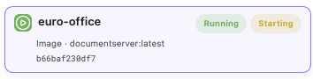

</div>

Every card carries its state badge first and its health badge second. The container above reports **Running** for its state and **Starting** for its health: it is up, and its first health check has not passed yet. Reading the two badges as a single status is what makes this look like a stuck action rather than the ordinary sequence it is.

The second badge becomes **Healthy** once a refresh sees Docker say so, or **Unhealthy** if the check fails. A container whose image defines no health check shows **No health check** in that position instead.

## 14. Container detail inspector

Select a container to open its read-only inspector. The inspector provides **Actions**, **Overview**, **State**, **Configuration**, **Networking**, **Storage**, **Metadata**, and safe diagnostics where those details are available. Depending on the container, this can include image, creation time, state, health, restart count, port bindings, networks, mounts, labels that are safe to show, and storage attachments.

The inspector lets you refresh details and copy the full container ID. It does not provide an interactive shell, file browser, log terminal, or arbitrary Docker API console.

### Container detail inspector
<div align="center">

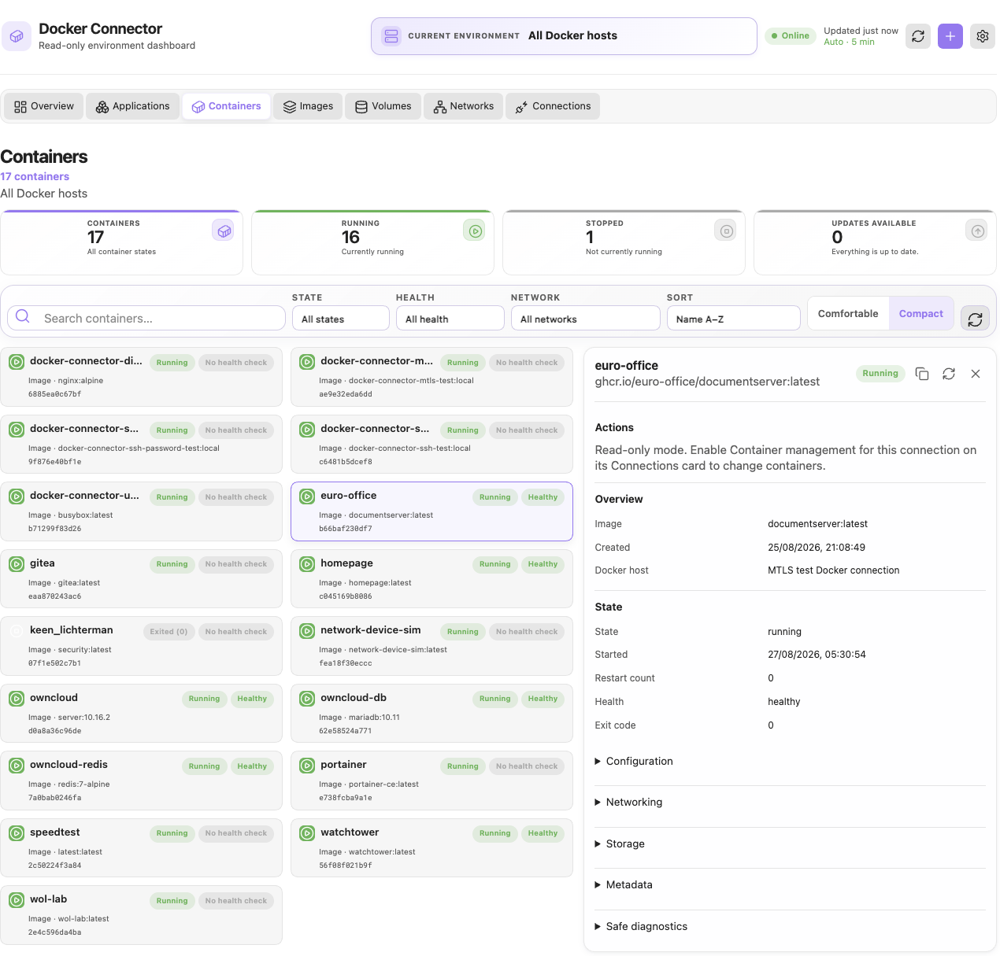

</div>

The inspector opens beside the list, and the container it describes stays highlighted in the inventory. Its header repeats the container name, full image reference, and state, with controls to copy the container ID, refresh the details, and close the panel.

**Actions** comes first. While the connection is read-only it states that fact and points at the Connections card that enables Container management for that host, rather than showing lifecycle controls. **Overview** and **State** are expanded; **Configuration**, **Networking**, **Storage**, **Metadata**, and **Safe diagnostics** are collapsed until you open them.

Metadata lists environment variable *names* only. Docker Connector never displays the values, so opening that section cannot reveal a secret held in a container's environment.

The **Image update** area is part of the Actions section and appears only while Container management is enabled for that connection, which is why it is absent above. Chapter 18 shows it in place.

## 15. Images

The **Images** tab is a read-only image inventory. Summary cards cover Images, In use, Dangling, and No visible references. You can search, filter by usage/tag state, architecture, and operating system, then sort by repository, tag, creation date, size, or usage count.

Select an image for an inspector with overview data, repository tags and digests, safe labels, and visible container references. Docker Connector does not delete images or expose arbitrary pull controls from this view.

### Images view
<div align="center">

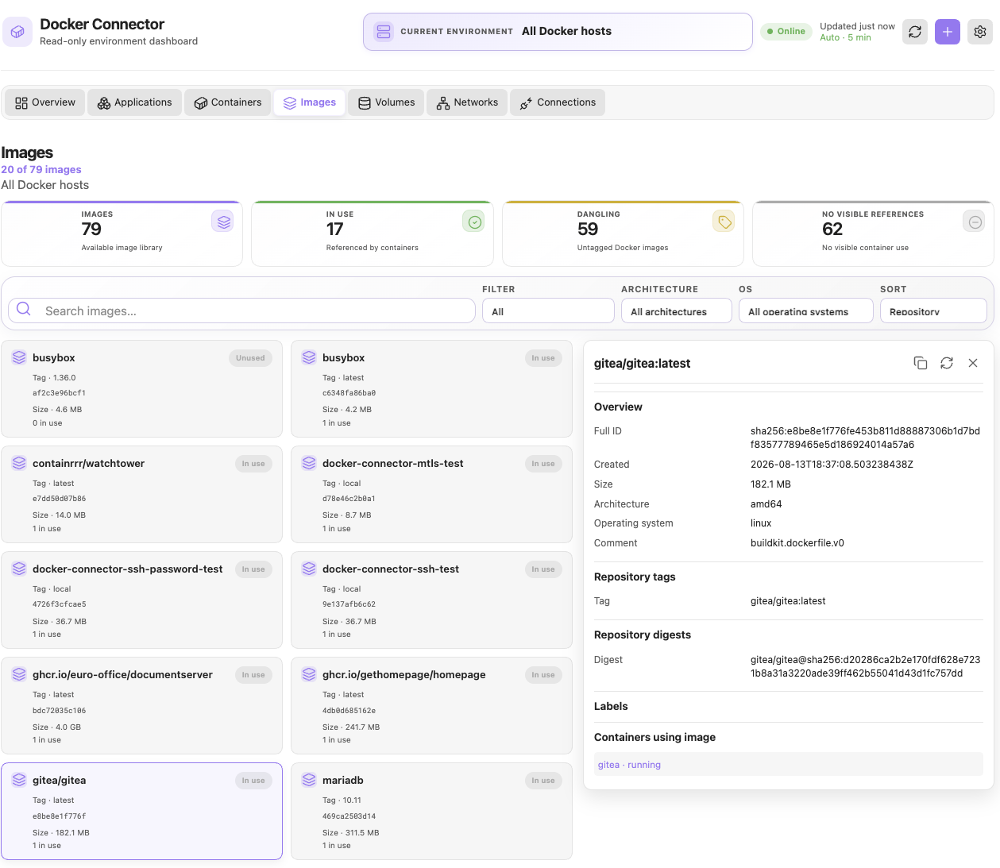

</div>

Each image card shows its repository and tag, short ID, size, and how many containers use it, with a badge of **In use**, **Unused**, or **Dangling**. The count above the summary cards can be lower than the **Images** total, as it is above: untagged images are kept out of the list until you choose the **Dangling** filter.

The four cards describe the same library from different angles. **In use** and **No visible references** split the images by whether a container on the refreshed host references them, so those two add up to the total. **Dangling** counts untagged images, which appear in one of the other two counts depending on whether a container still uses them.

Selecting an image opens the inspector with its full ID, creation time, size, architecture, operating system, build comment, repository tags and digests, labels, and the containers using it. Selecting a listed container opens it in **Containers**. Docker Connector does not delete images or pull them from this view.

## 16. Volumes

The **Volumes** tab lists Docker named volumes and their driver, scope, mountpoint summary, use state, and visible container count. It has summary cards for Volumes, In use, No visible references, and Drivers, plus search, driver, scope, and sort controls.

The volume inspector shows overview information, options, safe labels, and containers using the volume where Docker makes that relationship visible. Docker Connector does not delete volumes.

### Volumes view
<div align="center">

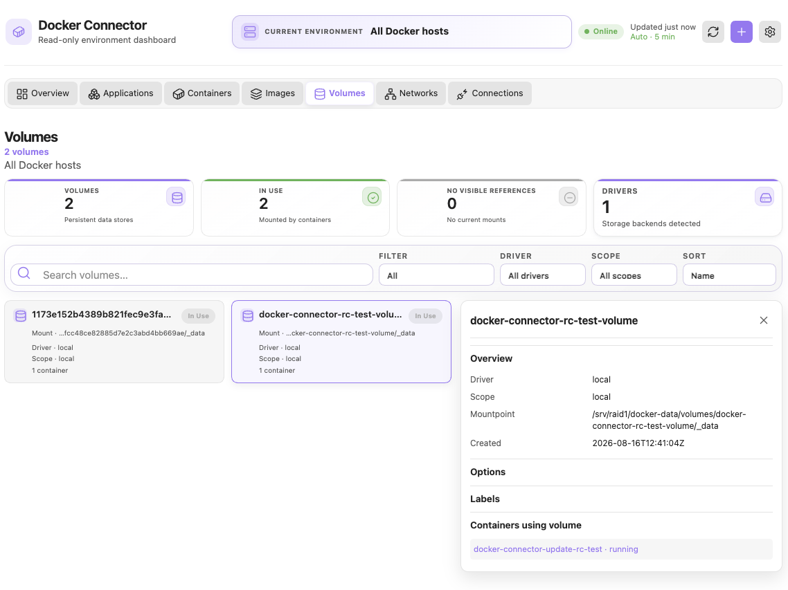

</div>

Each volume card shows its name, an **In use** or **Unused** badge, a shortened mount path, driver, scope, and the number of containers mounting it. The summary cards count the volumes, how many are mounted, how many have no current mounts, and how many distinct storage drivers are present.

Usage comes from named-volume mounts only. A container that reaches the same data through a bind mount does not make the volume **In Use**, because Docker does not report a bind mount as a named volume.

Selecting a volume opens the inspector with its driver, scope, mountpoint, creation time, options, labels, and the containers mounting it; selecting one of those containers opens it in **Containers**. Volumes are read-only here: Docker Connector never deletes or prunes a volume, and it does not browse the data inside one.

## 17. Networks

The **Networks** tab lists Docker network definitions. It distinguishes built-in and user-defined networks, shows unused networks, and supports search plus filters for type, driver, scope, internal/external, attachable, and IPv6-enabled networks.

Selecting a network shows driver, scope, internal and attachable settings, IPv6 status, gateways, and attached containers. When a subnet is available it is shown in the list. Docker Connector does not create, change, or delete networks.

### Networks view
<div align="center">

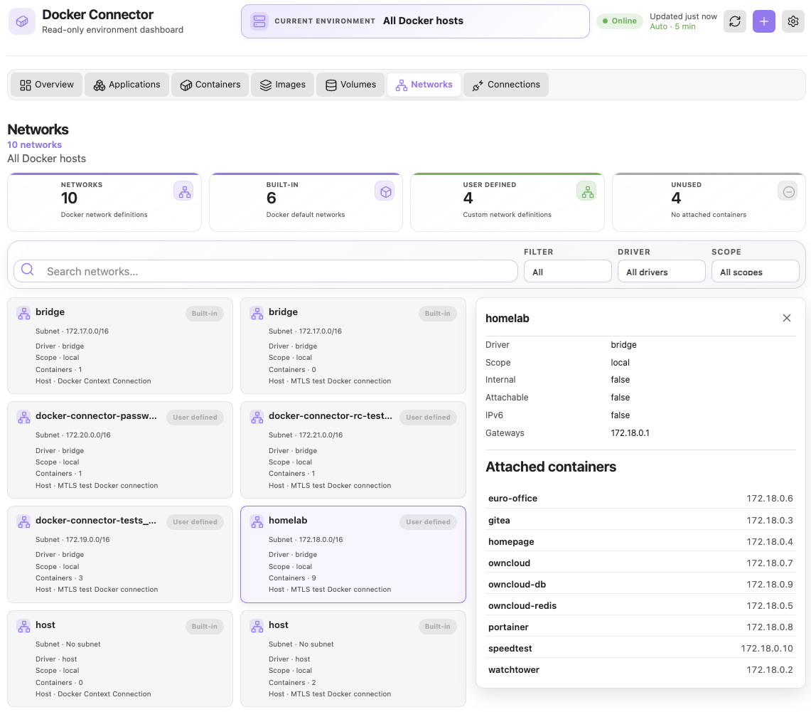

</div>

Each network card carries a **Built-in** or **User defined** badge, its subnet where one exists, driver, scope, and the number of attached containers. Docker creates `bridge`, `host`, and `none` on every daemon, so an **All Docker hosts** inventory lists those names once per daemon; the last line of each card names the connection whose inventory it came from, which is what tells the repeats apart.

The inspector adds the internal, attachable, and IPv6 settings, the gateways, and the attached containers with the address each one holds on that network. Selecting a container opens it in **Containers**.

The addresses come from the container inventory rather than a separate lookup, so a container attached to a network without an address of its own — `host` networking, for example — is listed without one.

## 18. Image update checking

Image update checking is advisory. Docker Connector compares the image used by an eligible container with the image currently resolved for its configured tagged image reference. It can show **Update status not checked**, **Checking for updates…**, **Update available**, **Image is current**, or a safe unavailable/error reason.

Automatic checks run on a 24-hour stale interval for eligible standalone containers **while Container management is enabled** and an Online snapshot is available. This is automatic checking, not automatic updating. Docker Connector never stops, restarts, recreates, or updates a container just because a scheduled check runs.

Choose **Check now** in the container inspector to perform a one-off check. The Docker daemon may pull or resolve image data to check the image ID, but Check now does not change the running container’s state.

### Image is current
<div align="center">

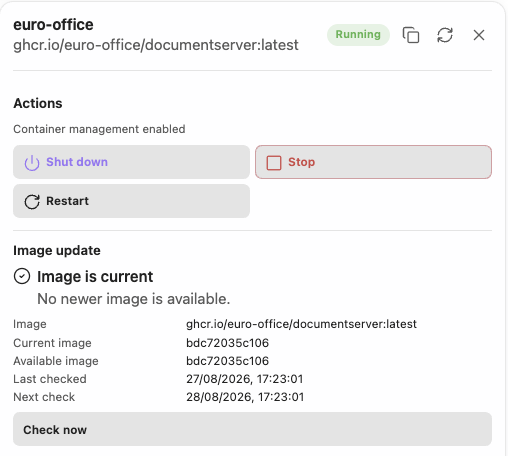

</div>

The **Image update** area sits inside **Actions** and appears only while Container management is enabled for the connection, which is why the panel above also shows lifecycle controls.

**Image is current** means the image ID resolved for the configured tag matches the one the container is running: **Current image** and **Available image** hold the same ID. **Image** repeats the configured reference that was checked, **Last checked** records the completed check, and **Next check** is 24 hours later — the point at which the result becomes stale and an automatic check may run again.

No **Update** action is offered, because there is nothing newer to move to. **Check now** stays available for an immediate re-check.

When a check finds a newer image the panel reports **Update available** instead, and the two IDs no longer match: **Current image** stays on the ID the container is running, while **Available image** shows the one just resolved for the configured tag. Nothing on the Docker host has changed at that point. The check resolves image metadata and leaves the container running exactly as it was.

What to do next depends on the container. An eligible standalone container gains an **Update** action beside **Check again**; selecting it opens the preview described in **20. Safe container update workflow** rather than changing anything immediately. A Compose-managed container shows **Update unavailable** with the reason instead of an action, because Compose owns that container's configuration: update it through its Compose project. Doing nothing is also a valid response — the advisory persists, and the next automatic check simply refreshes it.

> [!note] Availability is not eligibility
> **Update available** means a newer image is available. **Update eligibility** means Docker Connector can safely use its standalone update transaction. Compose-managed containers can have an available image but remain ineligible for the standalone Update action.

## 19. Container management

**Container management** is disabled by default, per connection, and session-only. Open **Connections** and use an **Online** host's **Container management** switch to enable it only for that profile when you trust it. Each profile is authorized independently. Enabling asks for confirmation because lifecycle and update actions change the Docker host.

Authorization is valid only while the profile remains continuously verified as **Online**. It is immediately cleared if that profile becomes Offline, Degraded, Authentication required, Unknown, Connecting, or unsupported; other authorized profiles are unaffected. A successful reconnect returns that profile to **Read-only**—it never restores authorization automatically. The backend also refuses a mutation unless the profile is still Online when the action runs.

When disabled, the Actions section says that the plugin is in read-only mode. When enabled, action availability depends on the container’s current state, host status, profile capabilities, and whether another operation is already in progress.

### Container management switch on a Connections card
<div align="center">

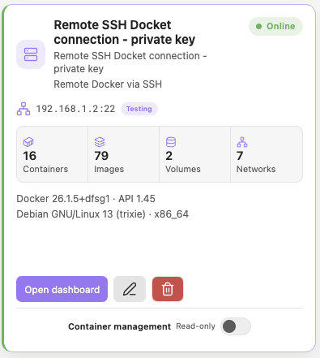

</div>

Every saved connection carries its own **Container management** switch at the bottom of its Connections card. It reads **Read-only** by default and after every Obsidian restart, and it is the only control that authorizes lifecycle and update actions for that host.

The switch is available only while that connection is **Online**; the card above also shows the host's inventory counts, Docker Engine details, and the endpoint the connection uses, so you can confirm you are enabling the host you intended.

### Container management disabled
<div align="center">

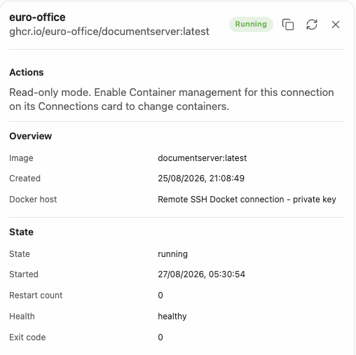

</div>

This is what a container's **Actions** section shows while its connection is read-only: a statement of the current mode and where to change it, in place of the Start, Shut down, Stop, Restart, and Update controls. The **Image update** area is absent for the same reason, since update checking belongs to Actions.

Nothing else is withheld. Overview, State, and the remaining sections stay fully readable, because read-only restricts what Docker Connector may change, not what it may show you. The **Docker host** row names the connection whose switch governs this container — useful when several connections reach the same Docker host.

### Enabling asks for confirmation
<div align="center">

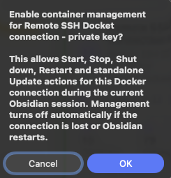

</div>

Turning the switch on asks for confirmation first, in an **Enable container management** dialog that names the connection you are about to authorize. It states exactly what is being granted — Start, Stop, Shut down, Restart, and standalone Update for that Docker connection — and that the authorization lasts only for the current Obsidian session, ending if the connection is lost or Obsidian restarts.

Choosing **Cancel**, or dismissing the dialog any other way, leaves the connection read-only and the switch returns to its previous position. Only **Enable management** grants the authorization. Read the connection name before accepting: authorization applies to that profile alone, and the actions it permits change the Docker host.

### Per-profile Container management enabled
<div align="center">

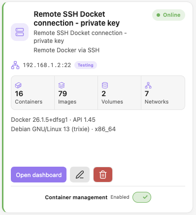

</div>

After accepting, the switch reads **Enabled** for that profile. Only this connection is authorized: every other saved connection stays **Read-only** until it is enabled on its own card.

The authorization is session-only and is never written to disk. It ends when Obsidian restarts or reloads, and it is revoked the moment the connection stops being Online — reconnecting returns the card to **Read-only** rather than restoring it. Turn the switch off yourself when you have finished the work that needed it.

### Start, Stop, Shut down, and Restart

- **Start** is available for stopped containers.
- **Shut down** requests Docker’s graceful stop behavior with a 30-second wait.
- **Stop** uses the normal stop action with a 10-second wait.
- **Restart** uses Docker’s restart action with a 10-second wait.

### Container management enabled
<div align="center">

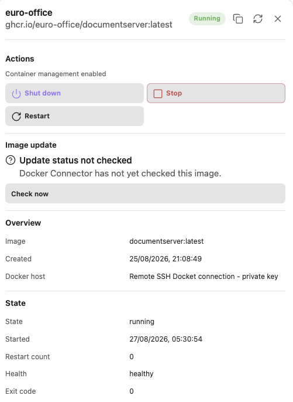

</div>

This is the same inspector shown earlier in read-only mode, with only the switch changed. **Actions** now reads **Container management enabled** and offers the controls that suit the container's current state: a running container gets **Shut down**, **Stop**, and **Restart**, and no **Start**, because it is already running.

The **Image update** area appears with it. Until a check has run it reports **Update status not checked**, and **Check now** performs one on demand. An **Update** action joins it only once a check confirms a newer image and the container is eligible for the standalone update workflow.

Docker Connector asks for confirmation before lifecycle actions and coordinates a refresh after an accepted action. These controls never appear as a bulk-action interface.

### Lifecycle action confirmation
<div align="center">

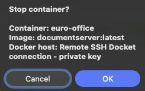

</div>

Start, Shut down, Stop, and Restart each ask before anything is sent. The dialog is titled with the action — **Start container**, **Stop container**, **Restart container**, or **Shut down container gracefully** — and lists the container, the image it runs, and the Docker host it belongs to. Check those three rows before accepting: they are what distinguishes the container you meant from a similarly named one on another host.

**Cancel**, or dismissing the dialog, sends nothing at all. The accepting button is labelled with the action itself — **Stop**, **Restart**, **Shut down**, **Start** — and sends exactly one typed action for that one container, after which Docker Connector refreshes the host and reports the outcome. There is no bulk action, and no way to apply a lifecycle action to several containers at once.

### Stopped container Start control
<div align="center">

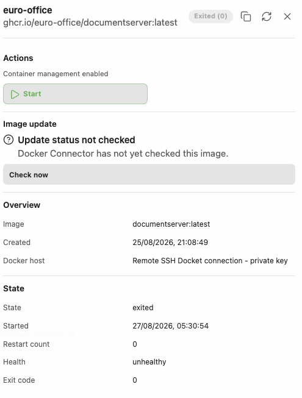

</div>

A stopped container offers **Start** alone. Shut down, Stop, and Restart are absent rather than disabled, because they apply only to a running container — the controls follow the container's current state.

**State** reports the container as Docker last recorded it: `exited` with its exit code, the time it last started, and the result of its final health check. That is why **Health** can still show a value for a container that is not running.

**Image update** remains available while the container is stopped. An image can be checked in either state, and an eligible stopped container can still be updated.

### Start confirmation
<div align="center">

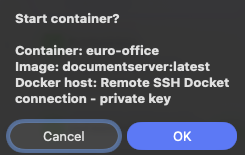

</div>

Starting a container is confirmed like every other action. The dialog title names the action, and the three rows beneath it identify the container, its image, and the Docker host, exactly as they do for a stop.

Bringing a container back up changes the Docker host as surely as taking it down, so it is never a single unconfirmed click. After **Start**, Docker Connector sends one Start, refreshes the host, and reports the result; the open inspector follows the container into its new state.

### Update

**Update** appears only when Container management is enabled, a newer image has been confirmed, and the container is eligible for the standalone update workflow. It is hidden when the current image is already current. Compose-managed containers and containers with unsupported configuration receive a safe reason instead of an unsafe generic update button.

## 20. Safe container update workflow

An eligible Update begins with a confirmation preview. It identifies the container and image, summarizes supported configuration preservation, shows warnings, and offers Cancel or a direct proceed action. There is no acknowledgement checkbox; the writable-layer warning remains prominent.

### What the preview shows

Choosing **Update** opens a read-only preview and changes nothing on the Docker host. Building it inspects the container once and reports what a replacement would be made from:

- The container's name, the Docker host and connection it belongs to, and whether it is currently running.
- The image reference that will be pulled, and the ID of the image the container runs today. Comparing those two is what the update is for.
- Counts of the things that must survive the replacement: named volumes, bind mounts, published ports, environment variables, and labels.
- The networks it is attached to, its restart policy, its stop timeout, whether it defines a health check, and — where set — its working directory, configured user, and read-only root filesystem.

Environment variables are counted, never listed. Their values are not shown in the preview, in progress messages, or in any error the transaction produces, because a container's environment is where secrets usually live.

The preview is also the last point at which nothing has happened. Cancelling leaves the container exactly as it was, and the update advisory remains for later.

The transaction is designed for standalone containers. It inspects the original container, validates eligibility, pulls the candidate image, compares image IDs, stops the original if needed, preserves it as a backup, creates and configures a replacement, restores supported networking, starts and verifies the replacement, then cleans up the backup where safe. The exact progress view reports the stage actually in progress.

### The stages, in order

Proceeding runs a fixed sequence, and the progress view names the stage actually running rather than a generic spinner:

1. **Inspecting the container** — the current configuration is read once and becomes the plan for the replacement.
2. **Validating the configuration** — eligibility is checked again, and any configuration the plugin cannot recreate faithfully stops the transaction here.
3. **Pulling the image** — the configured repository and tag are pulled through the Docker daemon.
4. **Comparing image versions** — the newly resolved image ID is matched against the one the container runs. If Docker cannot resolve an ID for the pulled reference, the transaction stops rather than guess.
5. **Stopping the original** — only if it was running, and using the container's own stop timeout.
6. **Creating the rollback backup** — the original container is *renamed*, not deleted, to a reserved name formed from its own name plus a `.docker-connector-backup-` suffix. The name is checked for conflicts first. The original container, with its writable layer, still exists at this point.
7. **Creating the replacement** — a new container is created under the original name, from the new image, with the captured configuration.
8. **Restoring network connections** — the replacement is created attached to the first network and connected to each remaining one by its Docker network ID, preserving aliases.
9. **Starting the replacement** — only if the original had been running.
10. **Verifying the replacement** — it must reach the state the original was in. If the image defines a health check, Docker Connector waits for it, polling every second for up to thirty seconds. A health check that reports unhealthy, or that has not passed by then, fails verification and triggers rollback.
11. **Removing the rollback backup** — the original container is deleted only after verification succeeds, and only with Docker's volume removal and force flags both off. Named volumes are never removed by an update.

Every mutation the transaction can make is restricted to that sequence. It can pull an image, stop, rename or start a container, create one, connect one to a network, and delete a container without touching its volumes. No other Docker route is reachable from an update, whatever happens mid-transaction.

You can cancel while it runs. Before the first mutation, cancelling simply stops. After mutation has begun, cancellation follows the same rollback path as a failure. If you cancel after the replacement has already been verified, the update stands and the backup is kept for you to inspect.

Docker Connector attempts to preserve the supported Docker configuration needed to recreate an eligible standalone container, including its relevant mounts, ports, restart configuration, and network attachments. No update workflow can make writable-layer-only data persistent.

### After a successful update

The result names the container that was replaced and the image IDs it moved between, and Docker Connector refreshes the host so the inventory reflects the new container. The replacement carries a new container ID: an update recreates a container rather than modifying one in place.

The update status for that container resets to current, so no further Update action is offered until a later check finds something newer.

## 21. Rollback and recovery

If a replacement cannot be created, started, or verified after mutation starts, Docker Connector attempts to restore the original container from its preserved backup. Results distinguish successful updates, updates where a backup is retained, already-current images, failure before mutation, failure with rollback, incomplete rollback, and cancellation.

Rollback is a recovery attempt, not an absolute guarantee against every host, storage, or Docker failure. If the result says a backup was retained, rollback is incomplete, or manual recovery is required, pause and inspect the reported container names and Docker state before taking further action. Do not repeatedly retry an unclear update result.

### Reading the result

Each outcome is reported distinctly, because what you should do next differs:

- **Updated** — the replacement is running and verified, and the backup has been removed. Nothing further is required.
- **Updated, backup retained** — the replacement is running and verified, but deleting the old container failed. The update succeeded; a stopped container with the `.docker-connector-backup-` name remains, and you can remove it yourself once satisfied.
- **Already current** — the pulled image matched the running one. Nothing was changed.
- **Cancelled** — you stopped the transaction. If it had passed verification, the replacement stands with its backup retained; otherwise the original was restored.
- **Failed before any change** — inspection, validation, the pull, or the image comparison failed while the container was still untouched. The original is running exactly as it was, and the reported code says which step refused.
- **Failed, original restored** — a mutation failed and rollback completed: the replacement was stopped and deleted, the backup was renamed back to the original name, and the original was returned to its previous running state and confirmed.
- **Rollback incomplete** — recovery could not be confirmed. This is the one result that needs you. It names the original container, the backup name it may still be under, and the replacement to check, so you can inspect Docker directly and decide.

The last case also covers a rarer situation: if Docker creates a replacement but does not return its identity, the transaction cannot safely delete what it cannot name, and it says so rather than guessing.

If Obsidian is closed or the plugin is reloaded during an update, in-flight transactions are cancelled and given a bounded fifteen seconds to complete their rollback. If that window passes, the result reports a timeout and names the container to verify — it does not claim a rollback that may not have finished.

> [!warning] Writable-layer data
> Data kept only in a container’s writable layer is not equivalent to a named volume or bind mount. Recreating a container can lose writable-layer-only changes. Persist important data with Docker volumes or bind mounts before updating.

## 22. Automatic refresh

Automatic refresh is enabled by default. The default interval is five minutes and can be changed to any whole number of minutes of at least one. Manual refresh performs one immediate snapshot refresh. Update checks use their separate 24-hour eligibility schedule and are not a substitute for snapshot refresh.

## 23. Settings

Docker Connector Settings provide:

- **Automatic refresh** — refresh configured hosts in the background.
- **Refresh interval** — minutes between background refreshes.
- **Theme integration** — use Obsidian’s native theme variables.

Container management is intentionally not a Setting. It is controlled only by the per-profile Connections-card switches and never persists across a restart or reload.

### Settings page
<div align="center">

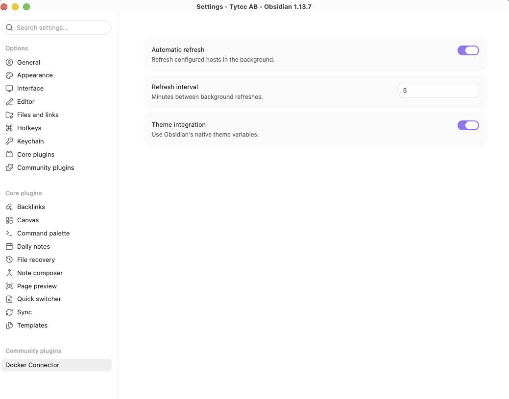

</div>

The tab appears in the Settings sidebar under **Community plugins**, as shown on the left above. The gear control in the Docker Connector header opens it directly. Note that **Browse** under Community plugins is not the way here: that list installs plugins from the public catalogue rather than showing an installed plugin's settings.

These three controls are the whole of what Docker Connector persists as preferences. **Automatic refresh** turns background refreshing on or off, **Refresh interval** sets the minutes between those refreshes, and **Theme integration** decides whether the dashboard draws from Obsidian's own theme variables.

**Container management** is deliberately absent. It is session-only and scoped to a single connection, so it belongs on that connection's card rather than in a setting that would outlive the session. Connections themselves are managed in the dashboard, not here.

## 24. Security model and saved information

Docker Connector saves connection metadata needed to reconnect, but keeps secrets out of saved settings where possible.

| Information | Saved in the profile? |
| --- | --- |
| Friendly name, description, category, host, and port | Yes |
| Docker Context name and safe endpoint snapshot | Yes |
| SSH username and private-key file path | Yes |
| SSH password | No by default; an explicit per-profile opt-in stores it separately in unencrypted local plugin data |
| SSH private-key passphrase | No — session-only |
| TLS CA, client-certificate, and client-private-key paths | Yes |
| TLS certificate/key contents | No |
| TLS client-key passphrase | No — session-only |

The plugin does not mutate Docker Contexts and does not support insecure `tcp://` Docker endpoints. Mutual TLS server verification is mandatory. Profile deletion clears runtime secrets and plugin-owned cached state but leaves external SSH and certificate files untouched.

## 26. Troubleshooting

### Docker CLI was not found

Docker Context needs a local Docker CLI. Confirm Docker is installed with:

```bash
docker --version
docker context ls
```

Docker Connector uses bounded PATH and standard-location discovery; it does not source `~/.zshrc`, `~/.bashrc`, or a login shell. If Terminal finds Docker but the plugin does not, restart Obsidian after installing Docker or Docker Desktop and use **Discover Contexts** again.

### Docker Engine unavailable

The Docker CLI being installed is not the same as Docker Engine being available. Check the engine with:

```bash
docker info
docker ps -a
```

Docker Desktop may be stopped, a remote Context endpoint may be unreachable, or a socket may be missing. Do not change the active Docker Context merely to make Docker Connector connect.

### Local Docker endpoint unavailable

Check that Docker is running and that your account can access the selected endpoint. On macOS, inspect a compatibility link safely with:

```bash
ls -l /var/run/docker.sock
```

Docker Connector validates symlinks and reports missing, broken, non-socket, looped, or inaccessible endpoints. Do **not** use `chmod 666 /var/run/docker.sock` as a workaround; that weakens Docker-host security.

### SSH authentication or host-key error

Verify the host, port, username, password/key, passphrase, remote Docker socket path, and Docker permissions for the remote account. Password authentication requires re-entry after an Obsidian restart unless **Remember password on this device** was explicitly enabled. An unencrypted private key reconnects automatically from its saved path; an encrypted private key requires its session-only passphrase again after restart. For a host-key mismatch, independently verify the new fingerprint before trusting it.

### Docker Context missing or changed

The named Context may have been removed or its endpoint configuration may have changed outside Docker Connector. Rediscover contexts and edit/retest the profile. Docker Connector will not repair the Context by changing Docker CLI state for you.

### Mutual TLS failure

Check the selected CA, client certificate, matching client private key, optional passphrase, and Server name. `DOCKER_TLS_HOSTNAME_MISMATCH` means the expected Server name does not match a valid certificate identity. An IP address must appear in an IP SAN; a hostname must appear in a DNS SAN. Do not disable certificate verification to work around this error.

### Client certificate rejected

The Docker Engine may require a certificate signed by a different CA, a client certificate with the proper client-authentication purpose, or a matching key. Recheck the server’s mutual-TLS configuration with its administrator; Docker Connector cannot make an untrusted client certificate acceptable.

### Remote user lacks Docker access or the socket path is wrong

For **Remote Docker via SSH**, first confirm the remote account can use Docker in a normal terminal session. A safe starting point is `docker version` and `docker ps -a` after logging in as that account. Check the configured Remote Docker socket against the host’s Docker configuration. Do not use an interactive `sudo` workaround: Docker Connector cannot answer an interactive privilege prompt, and changing socket permissions broadly is not a safe substitute for correct host access control.

### Update check failed, update is unavailable, or the image is already current

**Check now** can fail when the Docker daemon cannot pull or resolve the configured tagged image reference. Confirm the host’s ordinary Docker image access; Docker Connector does not collect or manage registry credentials. **Image is current** is a result, not a failure. **Update unavailable** can also mean that a container is Compose-managed, untagged, digest-only, or has configuration that cannot safely be recreated. Keep Docker Compose as the source of truth for Compose-managed containers.

### Update rollback, backup retained, or manual recovery

If a transaction reports that the original was restored, inspect the original container before retrying. If a backup was retained or manual recovery is required, stop and inspect the reported container names and state with `docker ps -a`; do not delete volumes, networks, images, or either container merely to clear the message. The plugin deliberately retains the safer recovery evidence rather than guessing which resource to remove.

### A profile cannot be deleted

Deletion is blocked while a container operation is active for that profile. Wait for the operation to reach a final result, then retry. If persistence fails, the profile remains saved rather than being partially removed; check vault/plugin-data write access before trying again.

### Connection stays Unknown

Unknown means not yet evaluated. Use Reconnect or refresh the profile. A completed attempt should become Online, Offline, Degraded, or Authentication required with a safe error. If it remains Unknown after a completed refresh, collect the diagnostics and report it as a problem.

### Update check or update unavailable

An image can be current, unavailable from a registry, untagged, inaccessible, Compose-managed, or unsuitable for safe standalone recreation. Check now does not override those safety restrictions. Registry authentication or pull failures must be resolved in the Docker environment; Docker Connector does not manage registry credentials.

## 27. Frequently asked questions

**Does Docker Connector store my SSH password?** Not by default. SSH passwords and key passphrases are runtime-only unless a password profile explicitly enables **Remember password on this device**. That opt-in stores only the password separately in unencrypted local plugin data; private-key passphrases are never stored.

**Does it store Mutual TLS passphrases or certificate contents?** No. It can save selected certificate/key paths, but not certificate contents or the client-key passphrase.

**Can I use it on mobile?** No. Docker Connector requires desktop Obsidian.

**Does it change my active Docker Context?** No. It discovers and uses the selected context without running Context mutation commands.

**Does it support insecure `tcp://host:2375`?** No. Plain unauthenticated Docker TCP is unsupported.

**Can it manage a remote Docker host?** Yes, after you explicitly enable Container management and only through the supported connection profile and typed actions.

**Can it update a Docker Compose application?** No. Applications are read-only and Compose-managed containers are blocked from the standalone Update workflow.

**Does deleting a connection delete the Docker server?** No. It removes Docker Connector’s profile and cached session state only.

**Does Update delete my volumes?** Docker Connector does not delete volumes. However, data stored only in a container writable layer may be lost when a container is recreated; use named volumes or bind mounts for persistent data.

**Why is Update missing?** It appears only for an eligible standalone container after a newer image has been confirmed and Container management is enabled.

**Can two profiles point to the same daemon?** Yes. For example, Local Docker Socket and Docker Context can intentionally reach the same local Docker Desktop daemon while remaining distinct saved profiles.

**Does Docker Connector send telemetry?** No telemetry or analytics service is part of the plugin. Its network activity is limited to configured Docker/SSH/TLS/Context connections, image-registry availability checks, and Docker-daemon image pulls used for supported update checks.

**Why does Docker CLI work in Terminal but not Obsidian?** Desktop GUI apps can inherit a different PATH. Docker Connector checks the process PATH and a bounded set of standard Docker locations, but it does not load shell startup files. Restart Obsidian after installing Docker and use **Discover Contexts** again.

**Why is Docker CLI found but the Engine unavailable?** CLI discovery only proves that the executable can run. The selected Context, socket, network endpoint, daemon, or account permissions can still prevent Docker Engine access.

## 28. Known limitations

- Docker Connector requires desktop Obsidian.
- Plain insecure Docker TCP is not supported.
- Applications is a Compose-aware read-only view; it does not deploy, edit, start, stop, or update Compose projects.
- Standalone transactional Update is intentionally blocked for Compose-managed and otherwise unsupported containers.
- Passwords and passphrases are session-only by default. Only an explicitly remembered SSH password can be rehydrated; private-key passphrases are never remembered. A saved unencrypted private key needs no runtime passphrase and reconnects automatically after restart.
- Some Docker Context endpoint types are blocked when they cannot be routed through an existing secure transport.
- Docker permissions, Docker Engine availability, registry access, and remote host policy ultimately control what the plugin can inspect or change.

## 29. Uninstalling Docker Connector

Disable or remove Docker Connector through Obsidian’s Community Plugins settings. Removing the plugin does not delete Docker containers, images, volumes, networks, Docker Contexts, SSH keys, TLS certificates, Docker sockets, or remote server configuration. Removing saved plugin data follows Obsidian’s normal plugin-data behavior; inspect your vault before manually deleting plugin files.

## 30. Glossary

- **Docker Engine / daemon:** The service that manages containers, images, volumes, and networks.
- **Docker socket:** A local Unix socket or Windows named pipe used to communicate with Docker Engine.
- **Docker Context:** A Docker CLI connection profile describing where and how Docker is reached.
- **SSH:** Secure Shell, a secure remote-session protocol.
- **Private key:** A secret key file used for SSH or client-certificate authentication.
- **Mutual TLS:** HTTPS where both the server and client prove their identities with certificates.
- **CA:** Certificate authority; the certificate used to verify a server certificate chain.
- **Client certificate:** A certificate presented by Docker Connector to a mutual-TLS Docker Engine.
- **Compose project / service:** Docker Compose’s grouping and service metadata, represented by Docker labels.
- **Container:** A running or stopped instance created from an image.
- **Image:** A packaged filesystem and metadata used to create containers.
- **Volume:** Docker-managed persistent storage that can outlive a container.
- **Network:** Docker’s connectivity definition for containers.
- **Health check:** Docker’s optional command-based health reporting for a container.
- **Writable layer:** Data written inside a container outside mounted persistent storage.
- **Rollback:** An attempt to restore the original container after an update transaction fails.

## 31. Reporting problems and getting help

When reporting a problem, include the connection method, safe error code or diagnostic stage, Docker Engine version, operating system, and the steps that reproduce the issue. Do not include passwords, passphrases, private keys, certificate contents, complete inspect output, or environment-variable values.

For implementation and security details, see [[Docker Connector - Security Review]], [[Docker Connector - Testing]], [[Docker Connector - Docker Context]], and the repository README.
