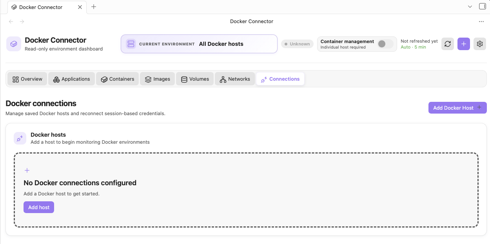
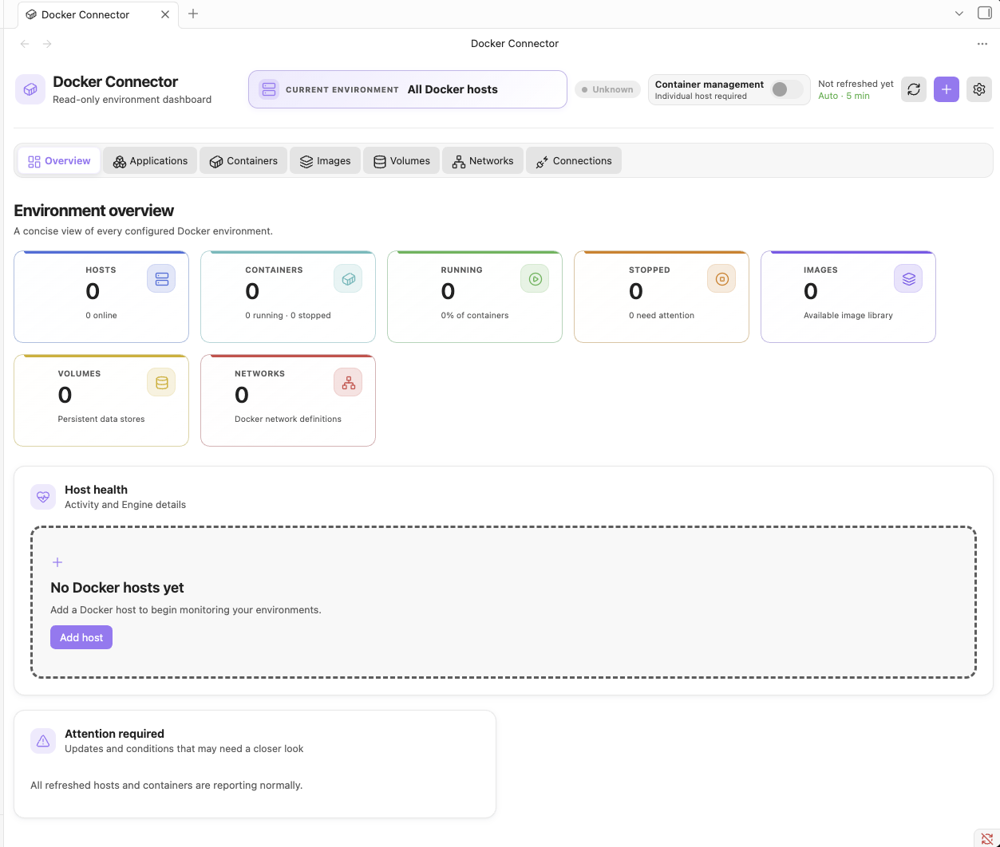
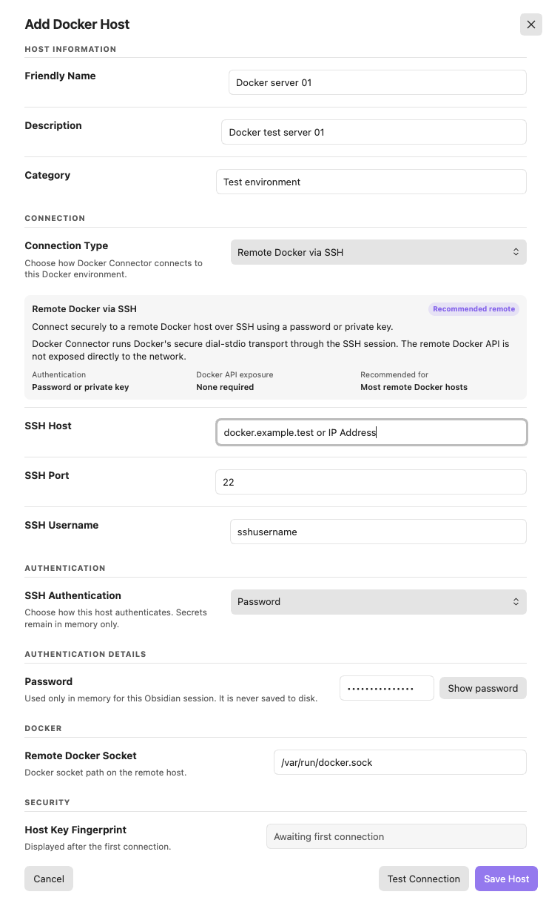
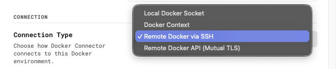
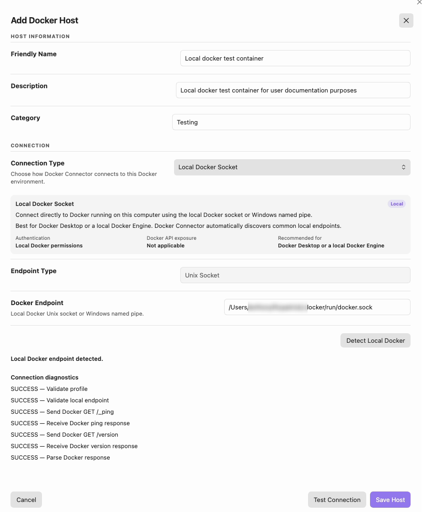
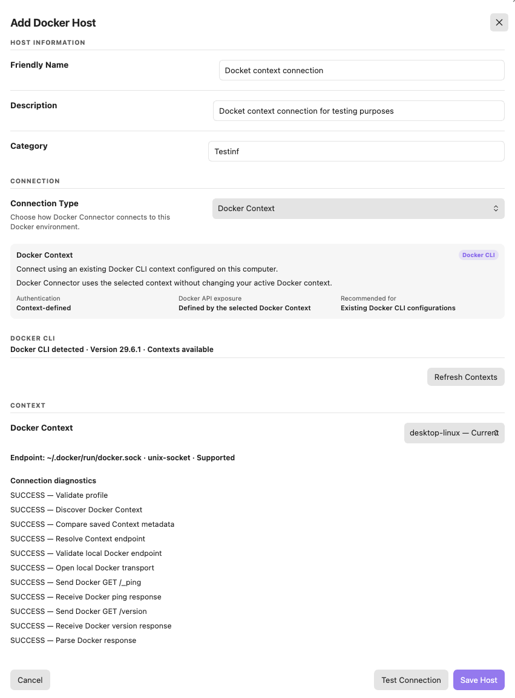
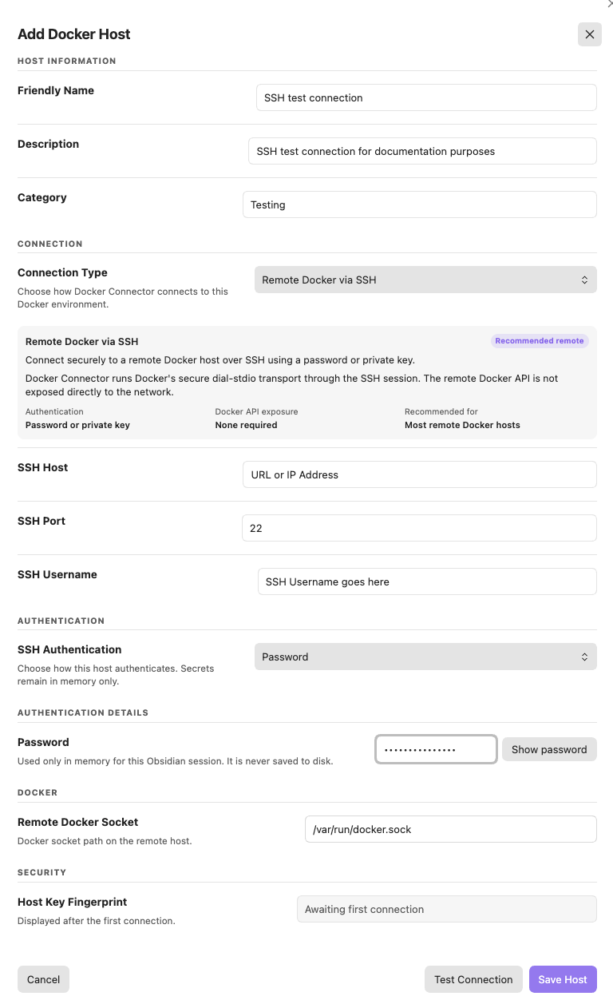
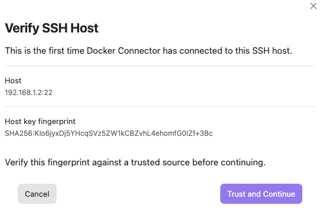
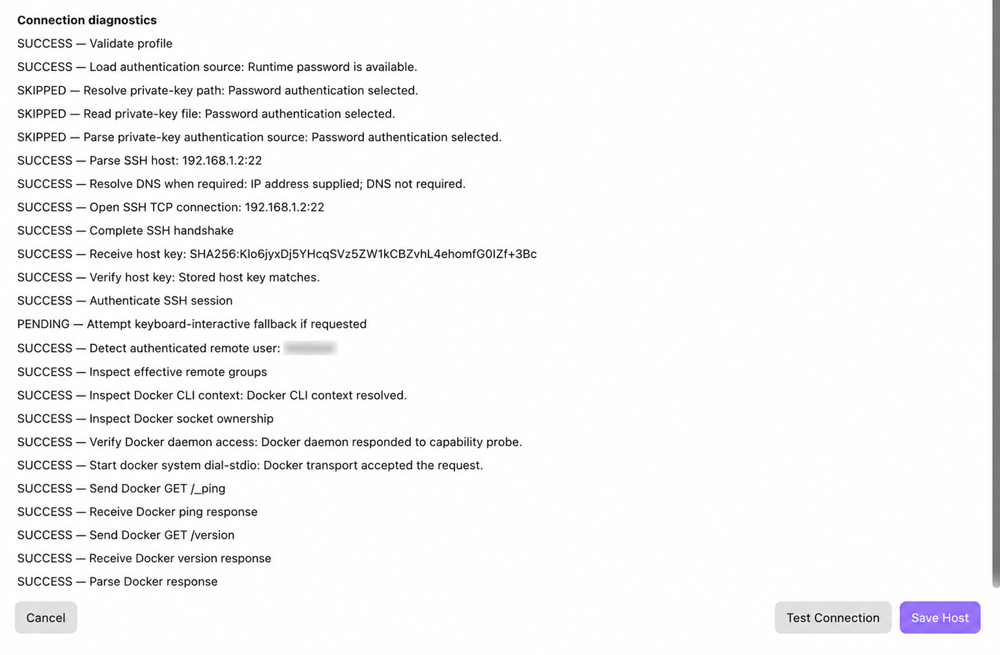
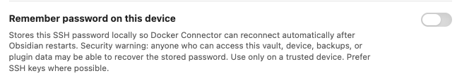

# Docker Connector User Guide

## Mobile and tablet access

Docker Connector supports desktop Obsidian plus iPhone and iPad. Local Docker Socket, Docker Context, Remote Docker via SSH, and Remote Docker API (Mutual TLS) use desktop-only runtime capabilities such as local sockets, the Docker CLI, SSH, or certificate files. They remain visible in a synced vault but are clearly unavailable on mobile.

For iPhone and iPad, add a **Docker Connector Gateway** profile. The Gateway is a separate, authenticated HTTPS service that is deployed next to Docker and exposes only Docker Connector's approved read operations. Enter its high-entropy access token only for the current Obsidian session; it is not saved in the profile. Use a trusted LAN or VPN and HTTPS. Never expose Docker's unauthenticated TCP API or disable certificate validation. The `gateway/` folder contains a constrained container example and deployment notes; mounting `docker.sock` remains highly privileged.

Docker Connector is an Obsidian desktop plugin for monitoring Docker environments and, when you explicitly enable it, carrying out a small set of container-management actions. It keeps local and remote Docker environments in one Obsidian workspace without trying to replace Docker Desktop, the Docker CLI, or a full deployment platform.

Docker Connector is read-only by default. You can inspect hosts, Docker Compose applications, containers, images, volumes, networks, and image-update availability without enabling container management. Lifecycle and update actions are deliberately opt-in.

> [!warning] Docker access is highly privileged
> A person or process that can control a Docker daemon can often gain extensive control of that Docker host. Connect only to hosts and credentials you trust. The safeguards in Docker Connector reduce accidental risk; they do not make Docker-daemon access low-risk.

## 1. About Docker Connector

Docker Connector supports multiple saved Docker environments. Each saved connection has its own status, inventory, cached dashboard data, and runtime credentials. Select one environment as the **Current Environment** to view its Overview, Applications, Containers, Images, Volumes, and Networks.

The current release supports five connection methods. Desktop methods use the local desktop runtime; Gateway is the mobile-safe HTTPS option:

| Method | Best for | Authentication | Direct Docker API exposure |
| --- | --- | --- | --- |
| Local Docker Socket | Docker running on the same computer as Obsidian | Local operating-system and Docker permissions | No |
| Docker Context | An existing Docker CLI configuration | Defined by the selected Context | Depends on the Context |
| Remote Docker via SSH | Most remote Docker hosts | Password or private key | No |
| Remote Docker API (Mutual TLS) | A deliberately secured direct Docker Engine API | CA certificate, client certificate, and client private key | Yes |
| Docker Connector Gateway | iPhone/iPad access to a trusted Docker host | Session-only Gateway token over HTTPS | No raw Docker API exposure |

Plain unauthenticated Docker TCP is not supported.

## 2. Important security information

Docker Connector is designed to make its boundaries visible:

- It is read-only until **Container management** is enabled for the selected Online connection from the header switch.
- Its normal Docker Engine client is limited to approved GET requests. Start, Stop, Shut down, Restart, and Update use dedicated, typed operations rather than a general-purpose Docker API console.
- Passwords and private-key passphrases are runtime-only by default. An SSH password profile can explicitly opt in to separate, unencrypted local plugin-data storage on a trusted device; see [[#Password authentication]].
- Remote Docker via SSH keeps Docker API traffic inside the SSH session. It does not require a direct Docker API listener.
- Mutual TLS requires server-certificate verification and a client certificate. Docker Connector does not offer an insecure “accept any certificate” mode.
- Docker Context discovery and use never changes your active Docker Context.
- Delete connection removes Docker Connector data only; it never deletes Docker resources or external credential files.

## 3. Requirements

Docker Connector supports desktop Obsidian on macOS, Windows, and Linux, plus responsive iPhone/iPad layouts. Local Docker Socket, Docker Context, SSH, and mutual TLS require desktop capabilities. On mobile, use an authenticated HTTPS **Docker Connector Gateway** profile; desktop-only profiles remain visible but unavailable there.

You also need appropriate access for the method you select:

- **Local Docker Socket:** Docker Engine or Docker Desktop running locally, and permission to open its socket or named pipe.
- **Docker Context:** Docker CLI installed locally and an existing Docker Context. The context is discovered; Docker Connector does not create or modify it.
- **Remote Docker via SSH:** SSH access to the Docker host and permission for that remote account to use the configured Docker socket without interactive `sudo`.
- **Remote Docker API (Mutual TLS):** a Docker Engine HTTPS endpoint configured for mutual TLS, plus a CA certificate, client certificate, and matching client private key.

## 4. Installation

When Docker Connector is available through Obsidian Community Plugins, install it from **Settings → Community plugins → Browse**, search for **Docker Connector**, then install and enable it. If it is not yet listed in the Community Plugin directory, use the project’s release instructions rather than copying source files into your vault.

For a manual release installation, the plugin directory needs only `main.js`, `manifest.json`, and `styles.css`. Source files, test fixtures, and `node_modules` are not required for normal use.

## 5. First launch

On first launch there are no saved Docker connections. Open **Connections** and choose **Add Docker Host**. After testing and saving a host, choose it as the Current Environment to populate the dashboard.

### Screenshot 01 — Empty Docker connections state


## 6. Understanding the interface

The header identifies the Current Environment and its connection status. Use the refresh control for an immediate read-only snapshot refresh. When automatic refresh is enabled, Docker Connector also refreshes configured hosts in the background at the interval chosen in Settings. With one individual **Online** host selected, the compact header **Container management** switch is available: **Read-only** is off and **Enabled** is on for that profile only. It is unavailable for **All Docker hosts** and for any non-Online profile.

The primary navigation contains **Overview**, **Applications**, **Containers**, **Images**, **Volumes**, **Networks**, and **Connections**. The resource tabs show data for the Current Environment; their search, filter, sort, and detail controls never mutate Docker resources.

### Screenshot 02 — Main Docker Connector dashboard


## 7. Adding a Docker host

1. Open **Connections**.
2. Select **Add Docker Host**.
3. Provide a **Friendly Name**. Description and Category are optional organization fields.
4. Select a **Connection Type**.
5. Complete only the fields for that method.
6. Choose **Test Connection** and review the transport-specific diagnostics.
7. Choose **Save Host**.

On desktop, drag the dialog by its title bar or resize it from its lower-right edge. On touch and narrow layouts, it remains viewport-safe without draggable controls.

### Screenshot 03 — Add Docker Host dialog


Testing before saving is strongly recommended. A successful test proves the selected profile can validate its endpoint and obtain safe Docker information; saving then registers the profile for the normal dashboard refresh lifecycle.

## 8. Connection methods

### Screenshot 04 — Connection Type selector


### 8.1 Local Docker Socket

**Local Docker Socket** connects to Docker running on the same computer as Obsidian. On macOS and Linux this is a Unix socket; on Windows it is a Docker named pipe. Docker Connector discovers common local endpoints and validates the endpoint before connecting.

On macOS, Docker Desktop commonly uses a user socket such as `~/.docker/run/docker.sock`; `/var/run/docker.sock` may be a compatibility symlink. Docker Connector resolves and validates supported socket symlinks rather than replacing them. No SSH credentials, TLS files, or Docker TCP listener are involved.

The **Docker Endpoint** field can show the detected local Unix socket or Windows named pipe. If Docker Desktop is stopped, the endpoint is missing, the symlink is broken, or your account cannot open it, Test Connection explains that local endpoint problem.

### Screenshot 05 — Local Docker Socket configuration


### 8.2 Docker Context

A **Docker Context** is a Docker CLI connection profile. Docker Connector finds existing contexts through the local Docker CLI and does not run `docker context use`, create, update, remove, import, or export a context.

This distinction matters: Docker Connector uses the context you select without changing the context that your terminal or other Docker tools consider active. The Docker CLI must be installed, but the CLI being present is separate from whether the Docker Engine is currently reachable.

The plugin performs bounded discovery of the Docker CLI from the current process PATH and standard platform locations. This helps normal macOS GUI launches, where Obsidian can inherit a different PATH than Terminal, without invoking a login shell or reading shell startup files.

### Screenshot 06 — Docker CLI detected
> **Screenshot placeholder 06**
>
> **Capture:** Docker Context configuration showing the detected Docker CLI/version and a discovered supported context.
>
> **How to capture this screenshot:**
> 1. Open **Add Docker Host** and select **Docker Context**.
> 2. Run context discovery and wait for Docker CLI discovery to finish.
> 3. Ensure the detected Docker CLI/version message and available-context count are visible.
> 4. Ensure at least one safe discovered context is visible, preferably `desktop-linux`, together with its **Current** marker when applicable.
> 5. Include the selected context's supported endpoint summary.
> 6. Use a normal test/local context setup; do not change the active Docker Context merely for the screenshot.
> 7. Avoid displaying private remote endpoints not intended for documentation.
> 8. Capture enough diagnostics to demonstrate that Docker Connector found the CLI, enumerated contexts, and resolved the selected context successfully.
>
> **Suggested filename:** `docs/images/user-guide/06-docker-cli-detected.png`



Docker Connector resolves a selected Context to the right physical transport each time it is used:

- a `unix://` Context uses the local Docker transport;
- a Windows `npipe://` Context uses the local named-pipe transport;
- an `ssh://` Context uses Docker CLI’s explicit Context-backed secure transport;
- insecure, unknown, and endpoint types that cannot be handled safely are blocked.

The saved profile and connection card still say **Docker Context**, even when the underlying transport is local.

### 8.3 Remote Docker via SSH

**Remote Docker via SSH** is usually the most straightforward remote choice. Docker Connector opens an SSH session and runs Docker’s secure `docker system dial-stdio` transport through that session. The Docker API is therefore transported over SSH and does not need to be directly exposed to the network.

Configure:

- **SSH Host** and **SSH Port**;
- **SSH Username**;
- **SSH Authentication**: Password or Private Key;
- **Remote Docker Socket**; and
- **Host Key Fingerprint** when host identity verification is required by the connection workflow.

The remote account must be able to access the configured Docker socket without interactive `sudo`.

#### Password authentication

With **Password** selected, enter the SSH password during connection or reconnection. Docker Connector keeps that password in memory only for the current Obsidian session by default. It is not stored in the saved profile, so a profile can show **Authentication Required** after Obsidian restarts. Choose **Reconnect** to provide it again.

For a password profile only, **Remember password on this device** is an optional, off-by-default choice. It stores the password separately in local plugin data so Docker Connector can reconnect after Obsidian restarts. Obsidian does not provide this plugin a supported keychain or guaranteed encryption, so use it only on a trusted device, prefer SSH keys where possible, and use **Forget stored password** to remove it immediately. It never applies to private-key passphrases, TLS passphrases, Gateway tokens, keys, or certificates. Host-key verification is still mandatory: a changed host key blocks reconnection even when a password is remembered.

### Screenshot 07 — Remote Docker via SSH password


#### Host-key verification

The **Host Key Fingerprint** identifies the remote SSH server. Docker Connector does not use `known_hosts`, auto-trust a first key, or silently replace a saved key.

1. Select **Test Connection**. An unknown server key opens **Verify SSH Host**, which shows the configured host and port and the received SHA-256 fingerprint.
2. Independently verify the fingerprint with the server administrator or a trusted out-of-band source. Select **Cancel** to leave the draft untrusted, or **Trust and Continue** to trust that received key only in the unsaved form.
3. **Trust and Continue** performs exactly one automatic retest with the same session-only credential. A successful SSH test shows the completed SSH handshake, host-key verification, SSH authentication, Docker `GET /_ping`, and Docker `GET /version` diagnostics. Authentication stages not selected for the profile are marked **SKIPPED**.
4. Select **Save Host** only after that successful retest. Saving persists the verified host-key fingerprint metadata, never a password or private-key passphrase.

### Screenshot 08 — Verify SSH Host


### Screenshot 09 — SSH connection success diagnostics


### Screenshot 10 — Remember SSH password option


With the option off, an Obsidian restart returns the profile to **Authentication Required** and **Reconnect** asks for the password again. With the option explicitly on, Docker Connector rehydrates the stored password only for that profile and only when the saved host-key fingerprint still matches. Use **Forget stored password** to remove it immediately. A changed host key always opens **SSH Host Identity Changed**, showing both trusted and received fingerprints with no replacement action; it blocks reconnection even when a password is remembered.

#### Private-key authentication

With **Private Key** selected, use **Browse…** to choose an existing key or **Generate SSH Key** to open a child setup dialog. It visibly progresses through preparing, generating the Ed25519 key, validating the private key, resolving the matching public key, and verifying the pair. On success it stays open with the public SHA-256 fingerprint until **Close** returns the fully validated selection to the host form. Generated keys use collision-safe names under `~/.ssh/` and Docker Connector never overwrites an existing key. Leave the passphrase blank to create an unencrypted key that can reconnect from its saved path after restart; an entered nonblank passphrase encrypts the key and remains in memory for the current session only. A passphrase is never saved, displayed, or included in diagnostics. Failures remain visible with **Retry** and do not change the host form.

For any selected private key, Docker Connector derives its public identity from that private key at install time and checks a sibling `<private-key>.pub` when present. A mismatched `.pub` file blocks installation; a missing one is derived in memory without changing the private key. **Install public key** opens a confirmation dialog and shows only the matching public fingerprint. Enter the current session-only SSH password there. Docker Connector sends only that public-key line through strict host-key verification and SFTP, then appends it to `~/.ssh/authorized_keys` only when its key type and base64 identity are missing. Existing entries are preserved. It never transfers the private key, uses `ssh-copy-id`, edits `known_hosts`, or bypasses a first-seen or changed host key. Test the selected private key successfully before saving the profile.

The profile can save the private-key file path, not a copy of the key material. An encrypted key’s passphrase remains in memory only for the current session; an unencrypted key simply has no passphrase to enter. Remembered SSH passwords never apply to private-key passphrases or public-key installation.

### Screenshot 11 — Remote Docker via SSH private key
> **Screenshot placeholder 11**
>
> **Capture:** Private Key controls with Browse, Generate SSH Key, and the generated-public-key installation action using a redacted path.
>
> **How to capture this screenshot:**
> 1. Open **Add Docker Host** and select **Remote Docker via SSH**.
> 2. Set **SSH Authentication** to **Private Key**.
> 3. Select **Generate SSH Key** or choose a disposable/test key path; never show key contents, a passphrase, or an identifying local path.
> 4. If a path is shown, use a test path or redact identifying path components before publication.
> 5. Leave **Private-Key Passphrase** blank and do not run installation against a production host.
> 6. Capture the Private Key File, generation, and passphrase controls without exposing key contents.
>
> **Suggested filename:** `docs/images/user-guide/11-ssh-private-key.png`

### 8.4 Remote Docker API (Mutual TLS)

### Screenshot 12 — Remote Docker API (Mutual TLS) form
> **Screenshot placeholder 12**
>
> **Capture:** Host, port, Server Name, CA, client certificate, and client key fields.
>
> **How to capture this screenshot:**
> 1. Open **Add Docker Host** and select **Remote Docker API (Mutual TLS)**.
> 2. Use the disposable mutual-TLS endpoint on `192.168.1.2:2376` or another safe test endpoint.
> 3. Fill Docker Host, Docker API Port, and Server Name with the test values.
> 4. Select test CA, client certificate, and client private-key files if safe to show their paths; otherwise use redacted/test-only paths.
> 5. Leave any passphrase blank for the capture.
> 6. Capture the form so Host, Port, Server Name, CA, client certificate, and client key fields are visible.

>
> **Suggested filename:** `docs/images/user-guide/12-mutual-tls-form.png`

**Remote Docker API (Mutual TLS)** is for a Docker Engine HTTPS endpoint that has deliberately been configured for mutual TLS. Unlike SSH, the Docker API endpoint is directly reachable on the network. Both sides authenticate:

- Docker Connector verifies the Docker server certificate against the selected CA and Server Name.
- Docker Engine verifies Docker Connector’s client certificate and private key.

Configure these fields:

| Field | Purpose |
| --- | --- |
| Docker Host | Network address of the Docker Engine endpoint. |
| Docker API Port | HTTPS port exposed by the secured Docker Engine endpoint. |
| Server Name | Certificate identity Docker Connector must verify. |
| CA Certificate | Certificate authority used to verify the Docker server certificate. |
| Client Certificate | Certificate presented to Docker Engine to authenticate Docker Connector. |
| Client Private Key | Private key associated with the client certificate. |
| Client-Key Passphrase | Optional passphrase for that private key; session-only. |

Server verification cannot be disabled. If the Server Name is an IP address, the server certificate must contain that IP in an **IP SAN**. If it is a DNS name, the certificate must contain the matching **DNS SAN**. A certificate common name alone is not a reliable substitute for a matching SAN.

Selected certificate and key paths may be saved as profile metadata; certificate contents and client-key passphrases are not persisted in settings.

### Screenshot 13 — Mutual TLS file validation
> **Screenshot placeholder 13**
>
> **Capture:** Successful certificate/key validation with redacted file paths.
>
> **How to capture this screenshot:**
> 1. Use the mutual-TLS test profile with valid test CA/client certificate/client-key files.
> 2. Open the Add/Edit dialog and select the files.
> 3. Wait for local file validation to report success.
> 4. Ensure only file paths/status are visible, never certificate or private-key contents.
> 5. Redact personal path components if needed while preserving enough of the filename to show which file is which.
> 6. Capture the successful validation state before or after Test Connection, whichever best isolates the file-validation UI.

>
> **Suggested filename:** `docs/images/user-guide/13-mutual-tls-validation.png`

## 9. Testing a connection

**Test Connection** validates a draft before it is saved or after it is edited. The diagnostics are deliberately transport-specific, so not every method shows the same stages. Typical stages include profile validation, Docker Context discovery, local endpoint validation, loading TLS files, opening a connection, server-certificate verification, server-name verification, Docker `GET /_ping`, Docker `GET /version`, and response parsing.

A completed stage is marked **SUCCESS**. An authoritative failure is **ERROR**. Stages that could not start after a failure are shown as **SKIPPED** or **NOT RUN**, rather than being presented as successful. For example, a mutual-TLS hostname mismatch stops before Docker API requests are used.

### Screenshot 14 — Mutual TLS identity failure
> **Screenshot placeholder 14**
>
> **Capture:** Safe hostname or certificate-identity mismatch result.
>
> **How to capture this screenshot:**
> 1. Use the disposable mutual-TLS test endpoint, not production.
> 2. Open its Add/Edit dialog and temporarily set **Server Name** to a deliberately incorrect harmless value such as `invalid.example.test`.
> 3. Select **Test Connection** and wait for the identity check to fail.
> 4. Ensure the diagnostic clearly shows the hostname/server-identity mismatch and later Docker request stages as skipped/not run.
> 5. Capture the error without exposing certificate contents.
> 6. Immediately restore the correct Server Name after capturing; do not save the deliberately invalid value.

>
> **Suggested filename:** `docs/images/user-guide/14-mutual-tls-identity-failure.png`

### Screenshot 15 — Successful Mutual TLS test
> **Screenshot placeholder 15**
>
> **Capture:** Successful mutual-TLS diagnostics.
>
> **How to capture this screenshot:**
> 1. Use the valid mutual-TLS test endpoint.
> 2. Open its Add/Edit dialog and select **Test Connection**.
> 3. Wait for all TLS identity checks and Docker API checks to finish successfully.
> 4. Ensure server certificate verification, Server Name verification, Docker `/_ping`, Docker `/version`, and the final success state are visible as space allows.
> 5. Do not show private-key contents or passphrases.
> 6. Capture only after the terminal success result is stable.

>
> **Suggested filename:** `docs/images/user-guide/15-mutual-tls-success.png`

### Screenshot 16 — Successful Local Docker test
> **Screenshot placeholder 16**
>
> **Capture:** Successful local Test Connection diagnostics.
>
> **How to capture this screenshot:**
> 1. With the local Docker Engine running, open a Local Docker Socket Add/Edit dialog.
> 2. Select **Test Connection**.
> 3. Wait until the diagnostics reach a successful terminal result.
> 4. Ensure successful endpoint validation, Docker `/_ping`, Docker `/version`, and the final successful result are visible as space permits.
> 5. Do not include unrelated terminal windows or Docker credentials.
> 6. Capture the diagnostics panel only after all relevant stages have completed.

>
> **Suggested filename:** `docs/images/user-guide/16-local-test-success.png`

## 10. Managing saved connections

Open **Connections** to manage every saved profile. The page begins with summary cards for **Configured hosts**, **Online**, and **Needs sign-in**; Needs sign-in counts only profiles in **Authentication Required**. For example, three configured profiles may show one Online and two Needs sign-in without changing either healthy profile’s state. It then provides **Add Docker Host** and a card for every profile. Each card uses one uniform structure: purple Docker host identity, textual connection method, transport-relevant safe endpoint details, inventory, runtime details, actions, and management row. Only the safe profile data and status vary by connection method.

### Screenshot 17 — Connections management view
> **Screenshot placeholder 17**
>
> **Capture:** Docker connections summary cards, profile cards, statuses, and management actions.
>
> **How to capture this screenshot:**
> 1. Open Docker Connector and select **Connections**.
> 2. Use a safe set of saved profiles that demonstrates more than one connection method if available.
> 3. Wait for status evaluation so the cards show stable states such as **Online** or **Authentication Required**, rather than transient Connecting where possible.
> 4. Ensure the **Configured hosts**, **Online**, and **Needs sign-in** summary cards, **Docker connections** heading, **Add Docker Host**, profile cards, status badges, inventory/runtime sections, left action group, and compact per-card **Container management** switch are visible. Each host card should use the same purple host icon, typography, and structure while showing only transport-relevant safe details. SSH cards should show only their `host:port` endpoint, without a username or passive Password/Private Key label.
> 5. If any hostnames or addresses should not be public, use disposable test profiles before capturing.

>
> **Suggested filename:** `docs/images/user-guide/17-connections-management.png`

Cards expose the applicable management actions:

### Screenshot 18 — Connection actions
> **Screenshot placeholder 18**
>
> **Capture:** Add, Edit, Reconnect, and Delete connection actions.
>
> **How to capture this screenshot:**
> 1. Open **Connections** with several safe/test profiles present.
> 2. Choose a mix of states if available so **Edit**, **Reconnect**, and **Delete** are visible across the cards.
> 3. Ensure **Add Docker Host** is visible at page level.
> 4. Do not click any action while taking the screenshot.
> 5. Capture a region wide enough to show the two-row footer clearly: actions, including Delete, in the first row and the centered compact per-card management switch in the second, without exposing sensitive host details.

>
> **Suggested filename:** `docs/images/user-guide/18-connection-actions.png`

- **Edit** opens the same profile workflow without changing the profile’s stable identity.
- **Reconnect** appears when session-only credentials need to be entered again.
- **Reconnect** appears when an offline or degraded connection can be retried.
- **Delete connection** opens a confirmation dialog.

Status is information, not an action. The current states are **Unknown**, **Connecting**, **Online**, **Offline**, **Degraded**, and **Authentication Required**. Unknown means the profile has not yet been evaluated or is between registration and its first refresh; it should not be a permanent result after a completed connection attempt. Authentication Required normally means a required runtime-only secret needs to be supplied again.

### Screenshot 19 — Authentication Required connection
> **Screenshot placeholder 19**
>
> **Capture:** A profile requiring a session-only credential and Reconnect.
>
> **How to capture this screenshot:**
> 1. Use an SSH profile whose password or encrypted-key passphrase is intentionally session-only.
> 2. Restart/reload Obsidian so the runtime credential is no longer present.
> 3. Open **Connections** and wait for the profile to settle into **Authentication Required**.
> 4. Ensure the **Reconnect** action is visible on the same profile card.
> 5. Do not enter the credential before taking the screenshot.
> 6. Capture the profile name, canonical connection method, Authentication Required badge, and Reconnect action.

>
> **Suggested filename:** `docs/images/user-guide/19-authentication-required.png`

### Delete connection

Deleting a connection removes only Docker Connector’s saved profile, runtime credentials, cached session data, and associated transport state. It does **not** stop or remove containers; delete images, volumes, or networks; remove Docker Contexts; delete SSH keys or TLS files; change Docker sockets; or change a remote server configuration. The confirmation dialog repeats this boundary before removal.

### Screenshot 20 — Delete connection confirmation
> **Screenshot placeholder 20**
>
> **Capture:** Confirmation scope and destructive action.
>
> **How to capture this screenshot:**
> 1. Create or use a disposable Docker Connector profile that can safely be deleted.
> 2. On **Connections**, select its **Delete** action.
> 3. Leave the confirmation dialog open without confirming deletion yet.
> 4. Ensure the text explaining that only the Docker Connector profile is removed—and Docker resources/external credential files are not deleted—is readable.
> 5. Capture the dialog with both Cancel and destructive confirmation controls visible.
> 6. After the screenshot, cancel unless you intentionally want to remove that disposable profile.

>
> **Suggested filename:** `docs/images/user-guide/20-delete-connection.png`

## 11. Switching environments

Use **Current Environment** to choose which saved host supplies dashboard data. Switching environment changes the data in Overview, Applications, Containers, Images, Volumes, and Networks. Profiles are isolated even if two profiles intentionally point to the same Docker daemon—for example, a Local Docker Socket profile and a Docker Context that resolves to Docker Desktop’s local socket.

If the selected profile is deleted, Docker Connector chooses a safe remaining profile where possible, preferring an Online profile. If no profiles remain, the dashboard returns to its no-host state.

### Screenshot 21 — Current Environment selector
> **Screenshot placeholder 21**
>
> **Capture:** Multiple profiles and the active environment.
>
> **How to capture this screenshot:**
> 1. Configure at least two safe profiles.
> 2. Open any resource view such as **Overview**.
> 3. Open the **Current Environment** selector.
> 4. Ensure multiple profile names and the currently selected environment are visible.
> 5. Avoid using sensitive production profile names if the guide will be public; create harmless test names if necessary.
> 6. Capture the selector while it is open.

>
> **Suggested filename:** `docs/images/user-guide/21-current-environment.png`

## 12. Overview

Overview is the host-level operational summary. It presents connection health, Docker version and host information when available, resource counts, refresh information, and attention items that deserve review. Attention items can include a host connection problem, an unhealthy container, a restarting or dead container, a non-zero exit, or an available public release where supported by the view.

Overview is not a metrics-history system. It shows the latest safe dashboard snapshot for the selected environment.

### Screenshot 22 — Populated Overview
> **Screenshot placeholder 22**
>
> **Capture:** An online host’s Overview and attention items where present.
>
> **How to capture this screenshot:**
> 1. Select a safe **Online** environment with a populated Docker inventory.
> 2. Open **Overview** and run a manual refresh if needed.
> 3. Wait until Docker version/host information, resource summary cards, refresh metadata, and any attention items are stable.
> 4. If possible use a test host with at least one meaningful but non-sensitive attention item; otherwise a clean populated Overview is acceptable.
> 5. Capture the full Overview content area without unrelated Obsidian panels.

>
> **Suggested filename:** `docs/images/user-guide/22-populated-overview.png`

## 13. Applications

Applications groups Docker Compose-managed containers into projects. Docker Connector uses Docker’s Compose metadata—especially `com.docker.compose.project` and `com.docker.compose.service`—rather than guessing project membership from names, paths, networks, or image references.

### Screenshot 23 — Applications list
> **Screenshot placeholder 23**
>
> **Capture:** Compose project cards, search, filters, and sorting.
>
> **How to capture this screenshot:**
> 1. Select the test environment that contains several Docker Compose projects.
> 2. Open **Applications** and wait for the snapshot to load.
> 3. Ensure project cards/rows, summary cards, search, status filter, update filter, and sort controls are visible.
> 4. Prefer the test applications such as Ghost/Umami rather than production-only projects if publication privacy matters.
> 5. Capture the list with at least two applications visible if possible.

>
> **Suggested filename:** `docs/images/user-guide/23-applications-list.png`

Application cards show a project’s services, container counts, running and stopped counts, available-update count where known, and associated networks, volumes, and images. The list supports searching, status and update filtering, sorting, and an inspector. The inspector exposes project details, services, containers, and images; selecting a listed container opens that container in **Containers**.

### Screenshot 24 — Application detail inspector
> **Screenshot placeholder 24**
>
> **Capture:** Services, containers, images, networks, and volumes as available.
>
> **How to capture this screenshot:**
> 1. Open **Applications** on the test host.
> 2. Select a Compose project with multiple services, preferably the `juliarosedelane` test application if it remains available.
> 3. Ensure the inspector shows project Overview plus Services, Containers, Images, Networks, and Storage/Volumes where available.
> 4. Position the view so service names are clearly distinct from container names and image tags.
> 5. Capture the detail panel with enough list context to identify the selected application.

>
> **Suggested filename:** `docs/images/user-guide/24-application-inspector.png`

For example, a project named `juliarosedelane` can contain services `ghost` and `ghost-db`, containers named `juliarosedelane-ghost` and `juliarosedelane-ghost-db`, and images such as `ghost:5-alpine` and `mysql:8.4`. These are different concepts, and Docker Connector keeps them separate.

Applications is read-only at the project level. Docker Connector does not run `docker compose up` or `docker compose down`, edit Compose files, or update a whole Compose application. A Compose-managed container can report that a newer image is available but remains blocked from the standalone Update workflow.

## 14. Containers

The **Containers** tab is the main container inventory. It has summary cards for **Containers**, **Running**, **Stopped**, and **Updates Available**. Selecting the Updates Available card filters the list; clear the active filter to return to the complete inventory.

### Screenshot 25 — Updates Available filter
> **Screenshot placeholder 25**
>
> **Capture:** Updates Available card or active filter state.
>
> **How to capture this screenshot:**
> 1. Ensure at least one safe test container currently has **Update available**.
> 2. Open **Containers**.
> 3. Click the **Updates Available** summary card so the list is filtered to containers requiring updates.
> 4. Confirm the active filter state is visible and only matching containers remain.
> 5. Capture the summary card/filter state plus the filtered results.
> 6. Clear the filter after capturing.

>
> **Suggested filename:** `docs/images/user-guide/25-updates-filter.png`

### Screenshot 26 — Containers view
> **Screenshot placeholder 26**
>
> **Capture:** Summary cards and populated container rows.
>
> **How to capture this screenshot:**
> 1. Select an Online test environment with several containers.
> 2. Open **Containers** and clear all active filters.
> 3. Wait for the inventory to finish loading.
> 4. Ensure the summary cards and several populated container rows are visible.
> 5. If possible include both running and stopped test containers, but do not change production container state merely for this screenshot.
> 6. Capture the main Containers list at a normal readable density.

>
> **Suggested filename:** `docs/images/user-guide/26-containers-view.png`

Use the toolbar to search by container information and filter by State, Health, and Network. Sort and density controls make it practical to work with larger inventories. Each row identifies the container, image, short ID, state, health, and relevant update state. Copy controls copy a full ID without changing the Docker host.

### Screenshot 27 — Container filters and search
> **Screenshot placeholder 27**
>
> **Capture:** Search, State, Health, Network, Updates, sort, and density controls.
>
> **How to capture this screenshot:**
> 1. Open **Containers** on a populated test host.
> 2. Ensure the toolbar is fully visible.
> 3. If necessary widen the Obsidian pane so Search, State, Health, Network, Updates, Sort, and Density controls are not clipped.
> 4. Leave filters at their neutral/default values unless an active filter makes the control clearer.
> 5. Capture the toolbar and enough container rows beneath it to show the controls affect an actual inventory.

>
> **Suggested filename:** `docs/images/user-guide/27-container-filters.png`

### Container health

Docker state and Docker health are distinct. A container can be Running, Stopped/Exited, Restarting, or Dead. Health can be Healthy, Unhealthy, or **No health check**. No health check means the image or container configuration does not define Docker health checks; it does not mean Docker considers the container unhealthy.

## 15. Container detail inspector

Select a container to open its read-only inspector. The inspector provides **Actions**, **Overview**, **State**, **Configuration**, **Networking**, **Storage**, **Metadata**, and safe diagnostics where those details are available. Depending on the container, this can include image, creation time, state, health, restart count, port bindings, networks, mounts, labels that are safe to show, and storage attachments.

The inspector lets you refresh details and copy the full container ID. It does not provide an interactive shell, file browser, log terminal, or arbitrary Docker API console.

### Screenshot 28 — Container detail inspector
> **Screenshot placeholder 28**
>
> **Capture:** Read-only sections and the Image update area.
>
> **How to capture this screenshot:**
> 1. Open **Containers** and select a safe test container.
> 2. Allow the detail inspector to populate.
> 3. Ensure **Actions**, **Overview**, **State**, **Configuration**, **Networking**, **Storage**, **Metadata**, and the **Image update** area are visible as much as the layout permits.
> 4. Use a test container whose metadata does not contain sensitive environment information.
> 5. Capture the inspector and selected container row; do not expand anything that would expose secrets.

>
> **Suggested filename:** `docs/images/user-guide/28-container-inspector.png`

## 16. Images

The **Images** tab is a read-only image inventory. Summary cards cover Images, In use, Dangling, and No visible references. You can search, filter by usage/tag state, architecture, and operating system, then sort by repository, tag, creation date, size, or usage count.

Select an image for an inspector with overview data, repository tags and digests, safe labels, and visible container references. Docker Connector does not delete images or expose arbitrary pull controls from this view.

### Screenshot 29 — Images view
> **Screenshot placeholder 29**
>
> **Capture:** Image inventory and detail inspector.
>
> **How to capture this screenshot:**
> 1. Select a populated Online test environment and open **Images**.
> 2. Wait for image inventory and summary counts to load.
> 3. Select a non-sensitive image so the inspector is visible.
> 4. Ensure the inventory, tags/IDs, usage information, and inspector are readable.
> 5. Do not expose registry credentials or private repository information not intended for publication.
> 6. Capture the Images view with both list and inspector if the layout allows.

>
> **Suggested filename:** `docs/images/user-guide/29-images-view.png`

## 17. Volumes

The **Volumes** tab lists Docker named volumes and their driver, scope, mountpoint summary, use state, and visible container count. It has summary cards for Volumes, In use, No visible references, and Drivers, plus search, driver, scope, and sort controls.

The volume inspector shows overview information, options, safe labels, and containers using the volume where Docker makes that relationship visible. Docker Connector does not delete volumes.

### Screenshot 30 — Volumes view
> **Screenshot placeholder 30**
>
> **Capture:** Named-volume inventory and inspector.
>
> **How to capture this screenshot:**
> 1. Select a test environment with at least one named Docker volume.
> 2. Open **Volumes** and wait for inventory to load.
> 3. Select a non-sensitive named volume.
> 4. Ensure the list shows driver/scope/use information and the inspector shows safe volume details/attached containers.
> 5. Avoid publishing host mount paths that reveal sensitive directory structure.
> 6. Capture the populated Volumes view and inspector.

>
> **Suggested filename:** `docs/images/user-guide/30-volumes-view.png`

## 18. Networks

The **Networks** tab lists Docker network definitions. It distinguishes built-in and user-defined networks, shows unused networks, and supports search plus filters for type, driver, scope, internal/external, attachable, and IPv6-enabled networks.

Selecting a network shows driver, scope, internal and attachable settings, IPv6 status, gateways, and attached containers. When a subnet is available it is shown in the list. Docker Connector does not create, change, or delete networks.

### Screenshot 31 — Networks view
> **Screenshot placeholder 31**
>
> **Capture:** Network inventory and attached-container details.
>
> **How to capture this screenshot:**
> 1. Select a test environment with user-defined Docker networks.
> 2. Open **Networks** and wait for inventory to load.
> 3. Select a non-sensitive network with attached test containers if possible.
> 4. Ensure driver, scope, internal/attachable/IPv6 information and attached containers are visible as available.
> 5. Avoid exposing network ranges that should remain private; use the isolated test network if needed.
> 6. Capture the populated Networks view and inspector.

>
> **Suggested filename:** `docs/images/user-guide/31-networks-view.png`

## 19. Image update checking

Image update checking is advisory. Docker Connector compares the image used by an eligible container with the image currently resolved for its configured tagged image reference. It can show **Update status not checked**, **Checking for updates…**, **Update available**, **Image is current**, or a safe unavailable/error reason.

Automatic checks run on a 24-hour stale interval for eligible standalone containers **while Container management is enabled** and an Online snapshot is available. This is automatic checking, not automatic updating. Docker Connector never stops, restarts, recreates, or updates a container just because a scheduled check runs.

Choose **Check now** in the container inspector to perform a one-off check. The Docker daemon may pull or resolve image data to check the image ID, but Check now does not change the running container’s state.

### Screenshot 32 — Image is current
> **Screenshot placeholder 32**
>
> **Capture:** Image update area showing Image is current and Check now.
>
> **How to capture this screenshot:**
> 1. Use an eligible standalone test container whose configured image is already current.
> 2. Enable Container management if update checking requires it.
> 3. Open the container inspector and select **Check now**.
> 4. Wait for the check to finish and display **Image is current**.
> 5. Ensure **Check now/Check again** is visible and no Update action is offered for a current image.
> 6. Capture the Image update area after the result stabilizes.

>
> **Suggested filename:** `docs/images/user-guide/32-image-current.png`

> [!note] Availability is not eligibility
> **Update available** means a newer image is available. **Update eligibility** means Docker Connector can safely use its standalone update transaction. Compose-managed containers can have an available image but remain ineligible for the standalone Update action.

### Screenshot 33 — Update available
> **Screenshot placeholder 33**
>
> **Capture:** Confirmed Update available state for an eligible standalone container.
>
> **How to capture this screenshot:**
> 1. Use only an eligible standalone disposable test container for which a newer tagged image can safely be made available.
> 2. Run **Check now** and wait for Docker Connector to confirm **Update available**.
> 3. Ensure the standalone **Update** action is visible/enabled and the status clearly identifies the newer image availability.
> 4. Do not use a Compose-managed or production container for this screenshot.
> 5. Capture before beginning the update transaction.

>
> **Suggested filename:** `docs/images/user-guide/33-update-available.png`

## 20. Container management

**Container management** is disabled by default, per connection, and session-only. Select an individual **Online** Docker connection and use either its header switch or its Connections-card switch to enable it only for that profile when you trust it. The two switches stay synchronized; more than one profile can be authorized independently. Enabling asks for confirmation because lifecycle and update actions change the Docker host.

Authorization is valid only while the profile remains continuously verified as **Online**. It is immediately cleared if that profile becomes Offline, Degraded, Authentication Required, Unknown, Connecting, or unsupported; other authorized profiles are unaffected. A successful reconnect returns that profile to **Read-only**—it never restores authorization automatically. The backend also refuses a mutation unless the profile is still Online when the action runs.

When disabled, the Actions section says that the plugin is in read-only mode. When enabled, action availability depends on the container’s current state, host status, profile capabilities, and whether another operation is already in progress.

### Screenshot 34 — Container management disabled
> **Screenshot placeholder 34**
>
> **Capture:** Read-only Actions panel and enable guidance.
>
> **How to capture this screenshot:**
> 1. Select an individual Online connection and ensure the header **Container management** switch is off.
> 2. Return to **Containers** and select any test container.
> 3. Open the **Actions** area.
> 4. Confirm it displays the read-only message/guidance rather than lifecycle controls.
> 5. Capture only the Actions area and enough container context to show what is being inspected.
> 6. Do not enable management until after this screenshot is complete.

>
> **Suggested filename:** `docs/images/user-guide/34-management-disabled.png`

### Screenshot 35 — Per-profile Container management enabled
> **Screenshot placeholder 35**
>
> **Capture:** An individual Online host with management enabled in the compact header and on its matching Connections card.
>
> **How to capture this screenshot:**
> 1. Select an individual known-safe **Online** test host in Docker Connector; do not use **All Docker hosts**.
> 2. Turn on **Container management** from either the header or that host’s Connections card.
> 3. Accept the confirmation only in an isolated test environment after confirming the configured environments are understood and you intend to continue test work.
> 4. Confirm the matching header/card controls are synchronized and show **Enabled** for that profile only.
> 5. Capture the enabled profile state; do not include credentials, unrelated settings, or Docker actions in progress.
> 6. If desired, disable management again after all management/update screenshots are finished.

>
> **Suggested filename:** `docs/images/user-guide/35-management-enabled.png`

### Start, Stop, Shut down, and Restart

- **Start** is available for stopped containers.
- **Shut down** requests Docker’s graceful stop behavior with a 30-second wait.
- **Stop** uses the normal stop action with a 10-second wait.
- **Restart** uses Docker’s restart action with a 10-second wait.

### Screenshot 36 — Stopped container Start control
> **Screenshot placeholder 36**
>
> **Capture:** Start action for a stopped standalone container.
>
> **How to capture this screenshot:**
> 1. Use only an approved disposable standalone test container.
> 2. Stop it using Docker outside the screenshot workflow or through a previously approved test action, then wait for Docker Connector to refresh to **Stopped/Exited**.
> 3. Open its inspector.
> 4. Ensure the **Start** action is visible and inappropriate running-only actions are absent/disabled according to the UI.
> 5. Capture before starting it again.
> 6. After capturing, return the test container to its desired normal state.

>
> **Suggested filename:** `docs/images/user-guide/36-stopped-start.png`

Docker Connector asks for confirmation before lifecycle actions and coordinates a refresh after an accepted action. These controls never appear as a bulk-action interface.

### Screenshot 37 — Running container lifecycle controls
> **Screenshot placeholder 37**
>
> **Capture:** Shut down, Stop, Restart, and Update eligibility where applicable.
>
> **How to capture this screenshot:**
> 1. Enable **Container management** only if you are working against an approved test container/environment.
> 2. Select a **running standalone test container** such as the disposable test container on `192.168.1.2`.
> 3. Open its inspector and locate **Actions**.
> 4. Ensure **Shut down**, **Stop**, and **Restart** are visible; **Update** may also appear only if that container is eligible and has an available image.
> 5. Do not click any lifecycle control for the screenshot.
> 6. Capture the Actions section and container identity clearly enough to show it is a test target.

>
> **Suggested filename:** `docs/images/user-guide/37-running-actions.png`

### Update

**Update** appears only when Container management is enabled, a newer image has been confirmed, and the container is eligible for the standalone update workflow. It is hidden when the current image is already current. Compose-managed containers and containers with unsupported configuration receive a safe reason instead of an unsafe generic update button.

## 21. Safe container update workflow

An eligible Update begins with a confirmation preview. It identifies the container and image, summarizes supported configuration preservation, shows warnings, and offers Cancel or a direct proceed action. There is no acknowledgement checkbox; the writable-layer warning remains prominent.

### Screenshot 38 — Update preview
> **Screenshot placeholder 38**
>
> **Capture:** Preview, configuration summary, and writable-layer warning.
>
> **How to capture this screenshot:**
> 1. Use the approved disposable standalone container with a confirmed available update.
> 2. Select **Update** to open the confirmation preview.
> 3. Do not proceed immediately.
> 4. Ensure the preview shows the container/image, supported configuration-preservation summary, writable-layer warning, **Cancel**, and **Proceed with update**.
> 5. Check carefully that no environment values or credentials appear.
> 6. Capture the complete preview dialog before selecting Proceed.

>
> **Suggested filename:** `docs/images/user-guide/38-update-preview.png`

The transaction is designed for standalone containers. It inspects the original container, validates eligibility, pulls the candidate image, compares image IDs, stops the original if needed, preserves it as a backup, creates and configures a replacement, restores supported networking, starts and verifies the replacement, then cleans up the backup where safe. The exact progress view reports the stage actually in progress.

### Screenshot 39 — Update progress
> **Screenshot placeholder 39**
>
> **Capture:** Real in-progress transaction stages.
>
> **How to capture this screenshot:**
> 1. Use only the approved disposable standalone test container.
> 2. From the Update preview, select **Proceed with update**.
> 3. Watch the progress view and capture while the transaction is actively between stages—not before it starts and not after it completes.
> 4. Prefer a moment showing several completed stages plus one clearly active stage such as creating, starting, or verifying the replacement.
> 5. Do not interrupt the transaction merely to obtain the screenshot.
> 6. If the operation completes too quickly to capture reliably, repeat only on the disposable test target when safe.

>
> **Suggested filename:** `docs/images/user-guide/39-update-progress.png`

Docker Connector attempts to preserve the supported Docker configuration needed to recreate an eligible standalone container, including its relevant mounts, ports, restart configuration, and network attachments. No update workflow can make writable-layer-only data persistent.

### Screenshot 40 — Successful update result
> **Screenshot placeholder 40**
>
> **Capture:** Completed replacement and image identifiers.
>
> **How to capture this screenshot:**
> 1. Complete a successful Update on the approved disposable standalone test container.
> 2. Wait for the final result state and subsequent refresh.
> 3. Ensure the result identifies successful completion and, where the UI provides them, original/replacement or image identifiers.
> 4. Confirm the replacement container is healthy/running before capturing.
> 5. Ensure no Update action remains if the image is now current.
> 6. Capture the final success/result panel.

>
> **Suggested filename:** `docs/images/user-guide/40-update-success.png`

## 22. Rollback and recovery

If a replacement cannot be created, started, or verified after mutation starts, Docker Connector attempts to restore the original container from its preserved backup. Results distinguish successful updates, updates where a backup is retained, already-current images, failure before mutation, failure with rollback, incomplete rollback, and cancellation.

Rollback is a recovery attempt, not an absolute guarantee against every host, storage, or Docker failure. If the result says a backup was retained, rollback is incomplete, or manual recovery is required, pause and inspect the reported container names and Docker state before taking further action. Do not repeatedly retry an unclear update result.

### Screenshot 41 — Rollback or recovery result
> **Screenshot placeholder 41**
>
> **Capture:** Safe rollback, backup-retained, or manual-recovery guidance.
>
> **How to capture this screenshot:**
> 1. Do **not** deliberately break a production or valued container to create this screenshot.
> 2. Prefer an existing safe rollback/recovery result from disposable testing if one occurs naturally, or create a controlled failure only on a dedicated disposable fixture designed for recovery testing.
> 3. Acceptable states include successful rollback, backup retained, or explicit manual-recovery guidance.
> 4. Ensure the screenshot clearly shows the recovery outcome and any safe container/backup names needed for understanding.
> 5. Do not expose environment values, credentials, or unrelated server data.
> 6. If no safe real recovery result is available, leave this placeholder uncaptured rather than manufacturing a misleading screenshot.

>
> **Suggested filename:** `docs/images/user-guide/41-update-recovery.png`

> [!warning] Writable-layer data
> Data kept only in a container’s writable layer is not equivalent to a named volume or bind mount. Recreating a container can lose writable-layer-only changes. Persist important data with Docker volumes or bind mounts before updating.

## 23. Automatic refresh

Automatic refresh is enabled by default. The default interval is five minutes and can be changed to any whole number of minutes of at least one. Manual refresh performs one immediate snapshot refresh. Update checks use their separate 24-hour eligibility schedule and are not a substitute for snapshot refresh.

## 24. Settings

Docker Connector Settings provide:

- **Automatic refresh** — refresh configured hosts in the background.
- **Refresh interval** — minutes between background refreshes.
- **Theme integration** — use Obsidian’s native theme variables.

Container management is intentionally not a Setting. It is controlled only by the synchronized per-profile header/card switches and never persists across a restart or reload.

### Screenshot 42 — Settings page
> **Screenshot placeholder 42**
>
> **Capture:** Automatic refresh, interval, and theme integration.
>
> **How to capture this screenshot:**
> 1. Open **Settings → Community plugins → Docker Connector** (or the plugin’s settings tab in the current Obsidian UI).
> 2. Position the settings pane so **Automatic refresh**, **Refresh interval**, and **Theme integration** are all visible; scroll only as needed.
> 3. Use normal/safe values and avoid showing unrelated vault/account settings.
> 4. Do not look for or capture Container management here: it is not a Setting. Capture only the persistent refresh and theme controls.
> 5. Capture the Docker Connector settings page at a width where labels, descriptions, and controls are readable.

>
> **Suggested filename:** `docs/images/user-guide/42-settings.png`

## 25. Security model and saved information

Docker Connector saves connection metadata needed to reconnect, but keeps secrets out of saved settings where possible.

| Information | Saved in the profile? |
| --- | --- |
| Friendly name, description, category, host, and port | Yes |
| Docker Context name and safe endpoint snapshot | Yes |
| SSH username and private-key file path | Yes |
| SSH password | No by default; an explicit per-profile opt-in stores it separately in unencrypted local plugin data |
| SSH private-key passphrase | No — session-only |
| TLS CA, client-certificate, and client-private-key paths | Yes |
| TLS certificate/key contents | No |
| TLS client-key passphrase | No — session-only |

The plugin does not mutate Docker Contexts and does not support insecure `tcp://` Docker endpoints. Mutual TLS server verification is mandatory. Profile deletion clears runtime secrets and plugin-owned cached state but leaves external SSH and certificate files untouched.

## 26. Troubleshooting

### Docker CLI was not found

Docker Context needs a local Docker CLI. Confirm Docker is installed with:

```bash
docker --version
docker context ls
```

Docker Connector uses bounded PATH and standard-location discovery; it does not source `~/.zshrc`, `~/.bashrc`, or a login shell. If Terminal finds Docker but the plugin does not, restart Obsidian after installing Docker or Docker Desktop and use **Discover Contexts** again.

### Docker Engine unavailable

The Docker CLI being installed is not the same as Docker Engine being available. Check the engine with:

```bash
docker info
docker ps -a
```

Docker Desktop may be stopped, a remote Context endpoint may be unreachable, or a socket may be missing. Do not change the active Docker Context merely to make Docker Connector connect.

### Local Docker endpoint unavailable

Check that Docker is running and that your account can access the selected endpoint. On macOS, inspect a compatibility link safely with:

```bash
ls -l /var/run/docker.sock
```

Docker Connector validates symlinks and reports missing, broken, non-socket, looped, or inaccessible endpoints. Do **not** use `chmod 666 /var/run/docker.sock` as a workaround; that weakens Docker-host security.

### SSH authentication or host-key error

Verify the host, port, username, password/key, passphrase, remote Docker socket path, and Docker permissions for the remote account. Password authentication requires re-entry after an Obsidian restart unless **Remember password on this device** was explicitly enabled. An unencrypted private key reconnects automatically from its saved path; an encrypted private key requires its session-only passphrase again after restart. For a host-key mismatch, independently verify the new fingerprint before trusting it.

### Docker Context missing or changed

The named Context may have been removed or its endpoint configuration may have changed outside Docker Connector. Rediscover contexts and edit/retest the profile. Docker Connector will not repair the Context by changing Docker CLI state for you.

### Mutual TLS failure

Check the selected CA, client certificate, matching client private key, optional passphrase, and Server Name. `DOCKER_TLS_HOSTNAME_MISMATCH` means the expected Server Name does not match a valid certificate identity. An IP address must appear in an IP SAN; a hostname must appear in a DNS SAN. Do not disable certificate verification to work around this error.

### Client certificate rejected

The Docker Engine may require a certificate signed by a different CA, a client certificate with the proper client-authentication purpose, or a matching key. Recheck the server’s mutual-TLS configuration with its administrator; Docker Connector cannot make an untrusted client certificate acceptable.

### Remote user lacks Docker access or the socket path is wrong

For **Remote Docker via SSH**, first confirm the remote account can use Docker in a normal terminal session. A safe starting point is `docker version` and `docker ps -a` after logging in as that account. Check the configured Remote Docker Socket against the host’s Docker configuration. Do not use an interactive `sudo` workaround: Docker Connector cannot answer an interactive privilege prompt, and changing socket permissions broadly is not a safe substitute for correct host access control.

### Update check failed, update is unavailable, or the image is already current

**Check now** can fail when the Docker daemon cannot pull or resolve the configured tagged image reference. Confirm the host’s ordinary Docker image access; Docker Connector does not collect or manage registry credentials. **Image is current** is a result, not a failure. **Update unavailable** can also mean that a container is Compose-managed, untagged, digest-only, or has configuration that cannot safely be recreated. Keep Docker Compose as the source of truth for Compose-managed containers.

### Update rollback, backup retained, or manual recovery

If a transaction reports that the original was restored, inspect the original container before retrying. If a backup was retained or manual recovery is required, stop and inspect the reported container names and state with `docker ps -a`; do not delete volumes, networks, images, or either container merely to clear the message. The plugin deliberately retains the safer recovery evidence rather than guessing which resource to remove.

### A profile cannot be deleted

Deletion is blocked while a container operation is active for that profile. Wait for the operation to reach a final result, then retry. If persistence fails, the profile remains saved rather than being partially removed; check vault/plugin-data write access before trying again.

### Connection stays Unknown

Unknown means not yet evaluated. Use Reconnect or refresh the profile. A completed attempt should become Online, Offline, Degraded, or Authentication Required with a safe error. If it remains Unknown after a completed refresh, collect the diagnostics and report it as a problem.

### Update check or update unavailable

An image can be current, unavailable from a registry, untagged, inaccessible, Compose-managed, or unsuitable for safe standalone recreation. Check now does not override those safety restrictions. Registry authentication or pull failures must be resolved in the Docker environment; Docker Connector does not manage registry credentials.

## 27. Frequently asked questions

**Does Docker Connector store my SSH password?** Not by default. SSH passwords and key passphrases are runtime-only unless a password profile explicitly enables **Remember password on this device**. That opt-in stores only the password separately in unencrypted local plugin data; private-key passphrases are never stored.

**Does it store Mutual TLS passphrases or certificate contents?** No. It can save selected certificate/key paths, but not certificate contents or the client-key passphrase.

**Can I use it on mobile?** Yes, with a Docker Connector Gateway profile over trusted HTTPS. Local sockets, Docker Context, SSH, and mutual TLS remain desktop-only.

**Does it change my active Docker Context?** No. It discovers and uses the selected context without running Context mutation commands.

**Does it support insecure `tcp://host:2375`?** No. Plain unauthenticated Docker TCP is unsupported.

**Can it manage a remote Docker host?** Yes, after you explicitly enable Container management and only through the supported connection profile and typed actions.

**Can it update a Docker Compose application?** No. Applications are read-only and Compose-managed containers are blocked from the standalone Update workflow.

**Does deleting a connection delete the Docker server?** No. It removes Docker Connector’s profile and cached session state only.

**Does Update delete my volumes?** Docker Connector does not delete volumes. However, data stored only in a container writable layer may be lost when a container is recreated; use named volumes or bind mounts for persistent data.

**Why is Update missing?** It appears only for an eligible standalone container after a newer image has been confirmed and Container management is enabled.

**Can two profiles point to the same daemon?** Yes. For example, Local Docker Socket and Docker Context can intentionally reach the same local Docker Desktop daemon while remaining distinct saved profiles.

**Does Docker Connector send telemetry?** No telemetry or analytics service is part of the plugin. Its network activity is limited to configured Docker/SSH/TLS/Context connections, image-registry availability checks, and Docker-daemon image pulls used for supported update checks.

**Why does Docker CLI work in Terminal but not Obsidian?** Desktop GUI apps can inherit a different PATH. Docker Connector checks the process PATH and a bounded set of standard Docker locations, but it does not load shell startup files. Restart Obsidian after installing Docker and use **Discover Contexts** again.

**Why is Docker CLI found but the Engine unavailable?** CLI discovery only proves that the executable can run. The selected Context, socket, network endpoint, daemon, or account permissions can still prevent Docker Engine access.

## 28. Known limitations

- Local sockets, Docker Context, SSH, and mutual TLS are desktop-only; mobile uses Docker Connector Gateway over trusted HTTPS.
- Plain insecure Docker TCP is not supported.
- Applications is a Compose-aware read-only view; it does not deploy, edit, start, stop, or update Compose projects.
- Standalone transactional Update is intentionally blocked for Compose-managed and otherwise unsupported containers.
- Passwords and passphrases are session-only by default. Only an explicitly remembered SSH password can be rehydrated; private-key passphrases are never remembered. A saved unencrypted private key needs no runtime passphrase and reconnects automatically after restart.
- Some Docker Context endpoint types are blocked when they cannot be routed through an existing secure transport.
- Docker permissions, Docker Engine availability, registry access, and remote host policy ultimately control what the plugin can inspect or change.

## 29. Uninstalling Docker Connector

Disable or remove Docker Connector through Obsidian’s Community Plugins settings. Removing the plugin does not delete Docker containers, images, volumes, networks, Docker Contexts, SSH keys, TLS certificates, Docker sockets, or remote server configuration. Removing saved plugin data follows Obsidian’s normal plugin-data behavior; inspect your vault before manually deleting plugin files.

## 30. Glossary

- **Docker Engine / daemon:** The service that manages containers, images, volumes, and networks.
- **Docker socket:** A local Unix socket or Windows named pipe used to communicate with Docker Engine.
- **Docker Context:** A Docker CLI connection profile describing where and how Docker is reached.
- **SSH:** Secure Shell, a secure remote-session protocol.
- **Private key:** A secret key file used for SSH or client-certificate authentication.
- **Mutual TLS:** HTTPS where both the server and client prove their identities with certificates.
- **CA:** Certificate authority; the certificate used to verify a server certificate chain.
- **Client certificate:** A certificate presented by Docker Connector to a mutual-TLS Docker Engine.
- **Compose project / service:** Docker Compose’s grouping and service metadata, represented by Docker labels.
- **Container:** A running or stopped instance created from an image.
- **Image:** A packaged filesystem and metadata used to create containers.
- **Volume:** Docker-managed persistent storage that can outlive a container.
- **Network:** Docker’s connectivity definition for containers.
- **Health check:** Docker’s optional command-based health reporting for a container.
- **Writable layer:** Data written inside a container outside mounted persistent storage.
- **Rollback:** An attempt to restore the original container after an update transaction fails.

## 31. Reporting problems and getting help

When reporting a problem, include the connection method, safe error code or diagnostic stage, Docker Engine version, operating system, and the steps that reproduce the issue. Do not include passwords, passphrases, private keys, certificate contents, complete inspect output, or environment-variable values.

For implementation and security details, see [[Docker Connector - Security Review]], [[Docker Connector - Testing]], [[Docker Connector - Docker Context]], and the repository README.


# Appendix A — Screenshot production checklist

This is an index and capture checklist; the full numbered screenshots and placeholders appear inline with the features they illustrate. Before committing screenshots, verify they do not expose passwords, passphrases, private keys, certificate contents, authentication tokens, registry credentials, container environment secrets, or sensitive internal host information not intended for publication.

| # | Filename | Section | Required capture |
| --- | --- | --- | --- |
| 01 | `01-empty-connections.png` | First launch | Empty state |
| 02 | `02-dashboard-overview.png` | Interface | Main dashboard |
| 03 | `03-add-docker-host.png` | Add | Host dialog |
| 04 | `04-connection-type-selector.png` | Add | Desktop methods / mobile Gateway |
| 05 | `05-local-docker-socket.png` | Local | Endpoint |
| 06 | `06-docker-cli-detected.png` | Context | CLI and context discovery |
| 07 | `07-ssh-password.png` | SSH | Password |
| 08 | `08-verify-ssh-host.png` | SSH | First host-key verification |
| 09 | `09-ssh-connection-success.png` | SSH | Trusted retry diagnostics |
| 10 | `10-remember-ssh-password.png` | SSH | Optional local password storage |
| 11 | `11-ssh-private-key.png` | SSH | Key |
| 12 | `12-mutual-tls-form.png` | Mutual TLS | Form |
| 13 | `13-mutual-tls-validation.png` | Mutual TLS | Files |
| 14 | `14-mutual-tls-identity-failure.png` | Testing | Identity error |
| 15 | `15-mutual-tls-success.png` | Testing | Test success |
| 16 | `16-local-test-success.png` | Testing | Local test success |
| 17 | `17-connections-management.png` | Connections | Profiles and actions |
| 18 | `18-connection-actions.png` | Connections | Actions |
| 19 | `19-authentication-required.png` | Connections | Reconnect |
| 20 | `20-delete-connection.png` | Connections | Confirmation |
| 21 | `21-current-environment.png` | Interface | Selector |
| 22 | `22-populated-overview.png` | Overview | Host summary |
| 23 | `23-applications-list.png` | Applications | List |
| 24 | `24-application-inspector.png` | Applications | Detail |
| 25 | `25-updates-filter.png` | Containers | Filter |
| 26 | `26-containers-view.png` | Containers | List |
| 27 | `27-container-filters.png` | Containers | Controls |
| 28 | `28-container-inspector.png` | Container detail | Detail |
| 29 | `29-images-view.png` | Images | Inventory |
| 30 | `30-volumes-view.png` | Volumes | Inventory |
| 31 | `31-networks-view.png` | Networks | Inventory |
| 32 | `32-image-current.png` | Image updates | Current |
| 33 | `33-update-available.png` | Image updates | Available |
| 34 | `34-management-disabled.png` | Container management | Read-only |
| 35 | `35-management-enabled.png` | Container management | Per-profile enabled |
| 36 | `36-stopped-start.png` | Container management | Start |
| 37 | `37-running-actions.png` | Container management | Running actions |
| 38 | `38-update-preview.png` | Update | Preview |
| 39 | `39-update-progress.png` | Update | Progress |
| 40 | `40-update-success.png` | Update | Result |
| 41 | `41-update-recovery.png` | Recovery | Result |
| 42 | `42-settings.png` | Settings | Full page |
